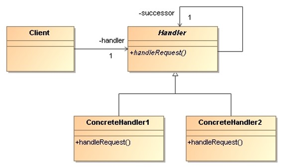
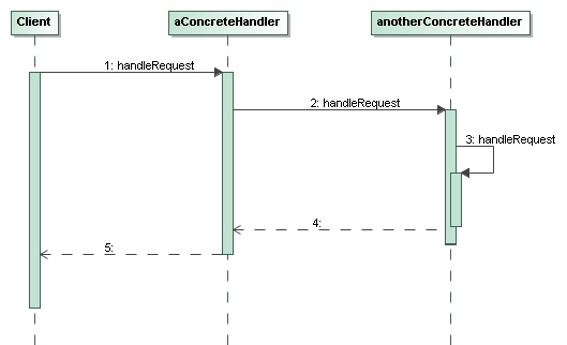

# Chain of Responsibility

> Avoid coupling the sender of a request to its receiver by giving 
> more that one object a chance to handle the request. Chain the 
> receiving objects and pass the requests along the chain until an 
> object handles it.

## Applicability

* More than one object may handle a request, and the handler isn’t known 
    a priori. 

* We want to issue a request to one of several objects without specifying 
    the receiver explicitly.

* The set of objects that can handle a request should be specified dynamically.

## Structure

* `Handler`: 
    * Defines an interface for handling requests.
    * Implements the successor link (optional).

* `ConcreteHandler`:
    * Handles requests it is responsible for.
    * Can access its successor.
    * If the `ConcreteHandler` can handle the request, it does so. 
        Otherwise it forwards the request to its successor.

* `Client`:
    * Initiates the request to a ConcreteHandler object on the chain.

## Collaborations

When a client issues a request, the request propagates along the chain 
until a `ConcreteHandler` object takes responsibility for handling it.

## Consequences

* **Reduced coupling**: The pattern frees an object from knowing which 
    other object handles a request. Both the receiver and the sender 
    have no explicit knowledge of each other, and an object in the chain 
    doesn’t have to know about the chain’s structure.

* **Receipt isn’t guaranteed**: Since a request has no explicit receiver, 
    there’s no guarantee it’ll be handled – the request can fall off the 
    end of the chain without ever being handled. A request can also go 
    unhandled when the chain is not configured properly.

## Implementation Issues

* **Handler with default implementation**: The Handler not only defines 
    the interface for the requests but usually maintains the successor 
    as well. That lets the handler provide a default implementation of 
    `handleRequest()` that forwards the request to the successor.  
    
    If a `ConcreteHandler` subclass isn’t interested in the request, it 
    doesn’t have to override the forwarding operation, since the default
    implementation forwards unconditionally.

* **Representing requests**:
   * The request is a hard-coded operation invocation.
    * We can use a single handler method that takes a request code as 
        parameter.

## Examples 

* _Demo_: [Mail Handler](ChainOfResponsibility-MailHandler/)
* _Exercise_: [HTTP Request Handler](ChainOfResponsibility-HttpRequestHandler-Exercise) - ([Model solution](Facade-DigestService))
* _Exercise_: [Key Handler](ChainOfResponsibility-KeyHandler-Exercise/) - ([Model solution](ChainOfResponsibility-HttpRequestHandler/))

## References 

* E. Gamma, R. Helm, R. Johnson, J. Vlissides. **Design Patterns, Elements of Reusable Object-Oriented Software**. Addison-Wesley, 1995
    * Chapter 5: Behavioral Patterns

*Egon Teiniker, 2016-2024, GPL v3.0*

