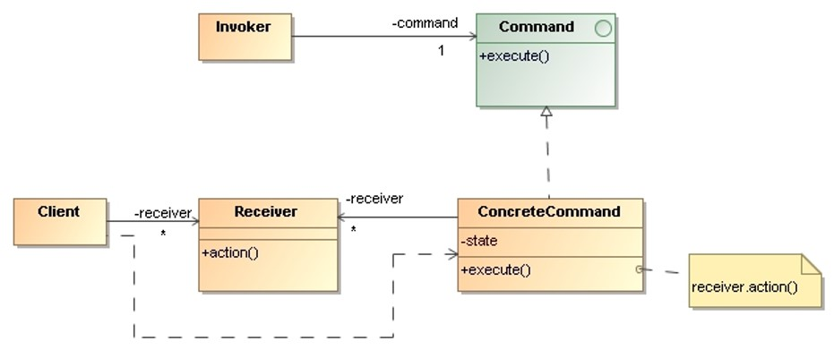

# Command

> Encapsulate a request as an object, thereby letting us parameterize clients 
> with different requests, queue or log requests, and support undoable operations.

## Applicability

* We need an object-oriented replacement for **callback functions**.
* We want to specify, queue, and execute requests at different times. 
* We want to support **undo**. The command’s execute operation can store 
    state for reversing its effects in the command itself.

## Structure

* `Command`: Declares an interface for executing an operation.
* `ConcreteCommand`: Implements execute by invoking the corresponding 
    operations on Receiver.
* `Client`: Creates a ConcreteCommand object and sets its receiver.
* `Invoker`: Ask the command to carry out the request.
* `Receiver`: Knows how to perform the operations associated with carrying 
    out a request. Any class may serve as a `Receiver`.

## Collaborations
* The client creates a `ConcreteCommand` object and specifies its `Receiver`.
* An `Invoker` object stores the `ConcreteCommand` object.
* The `Invoker` issues a request by calling execute on the `Command`.
* The `ConcreteCommand` object invokes operations on its receiver to carry 
    out the request.

## Consequences

* Command **decouples the object that invokes the operation from the one 
    that knows how to perform it**.
* Commands can be manipulated and extended like any other object.
* We can **assembly commands** into a composite command.
* It’s easy to add new `Commands`, because you don’t have to change 
    existing classes. 

## Implementation Issues

* **How intelligent** should a command be?
    * At one extreme it merely defines a binding between a receiver and 
        the actions that carry out the request.
    * At the other extreme it implements everything itself without delegating 
        to a receiver at all.

* Supporting **undo and redo**: Commands can support undo and redo 
    capabilities if they provide a way to reverse their execution.

## Examples 

* _Demo_: [List Processor](Command-ListProcessor/)
* _Demo_: [Runnable](Command-Runnable/)
* _Demo_: [SQL Command](Command-SQL/)
* _Exercise_: [Comparator](Command-Comparator-Exercise/) - ([Model solution](Command-Comparator/))
* _Demo_: [Comparator Lambda](Command-Comparator-Lambda/)
* _Exercise_: [Merger](Command-Merger-Exercise/) - ([Model solution](Command-Merger/))
   

## References 

* E. Gamma, R. Helm, R. Johnson, J. Vlissides. **Design Patterns, Elements of Reusable Object-Oriented Software**. Addison-Wesley, 1995
    * Chapter 5: Behavioral Patterns

*Egon Teiniker, 2016-2024, GPL v3.0*
