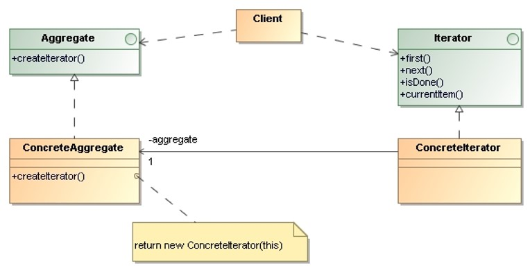

# Iterator

> Provide a way to access the elements of an aggregate object sequentially 
> without exposing its underlying representation.
 

## Applicability

* To access an aggregate object’s content without exposing its internal
    representation. 
* To support multiple traversals of aggregate objects.
* To provide a uniform interface for traversing different aggregate 
    structures (polymorphic iteration).
 

## Structure

* `Iterator`: Defines an interface for accessing and traversing elements.
* `ConcreteIterator`: Implements the `Iterator` interface. Keeps track of 
    the current position in the traversal of the Aggregate.
* `Aggregate`: Defines an interface for creating an `Iterator` object.
* `ConcreteAggregate`: Implements the `Iterator` creation interface to return 
    an instance of the proper `ConcreteIterator`.

## Collaborations

* A `ConcreteIterator` keeps track of the current object in the aggregate
    and can compute the succeeding object in the traversal.

## Consequences

* **It supports variations in the traversal of an aggregate**.
    Complex aggregates may be traversed in many ways. Iterators make it 
    easy to change the traversal algorithm by replacing the `Iterator` 
    instance with a different one.
* **Iterators simplify the `Aggregate` interface**.
    Iterator’s traversal interface obviates the need for a similar 
    interface in `Aggregate`.
* **More than one traversal can be pending on an aggregate**.
    An iterator keeps track of its own traversal state. Therefore, 
    you can have more that one traversal in progress at once. 

## Implementation Issues

A fundamental issue is deciding which party controls the iteration:
* **External iterator**: The client controls the iteration. 
    Clients that use an external iterator must advance the traversal 
    and request the next element explicitly from the iterator.

* **Internal iterator**: the iterator controls the iteration. The 
    client hands an internal iterator an operation to perform, and 
    the iterator applies that operation to every element in the 
    aggregate.

* **How robust is the iterator?**\
    It can be dangerous to modify an aggregate while traversing it. 
    If elements are added or deleted from the aggregate, we might end 
    up accessing an element twice or missing it completely.

* **Additional Iterator operations**: The following additional 
    operations might prove useful:
    * **previous()** operation that positions the iterator to the 
        previous element.
    * **skipTo()** operation that positions the iterator to an object 
        matching specific criteria.

## Examples 

* _Demo_: [List - External Iterator](Iterator-Extern-List/)
* _Demo_: [List - Internal Iterator](Iterator-Intern-List/)
* _Demo_: [List - ForEach](Iterator-Intern-ForEach/)

## References 

* E. Gamma, R. Helm, R. Johnson, J. Vlissides. **Design Patterns, Elements of Reusable Object-Oriented Software**. Addison-Wesley, 1995
    * Chapter 5: Behavioral Patterns

*Egon Teiniker, 2016-2024, GPL v3.0*

