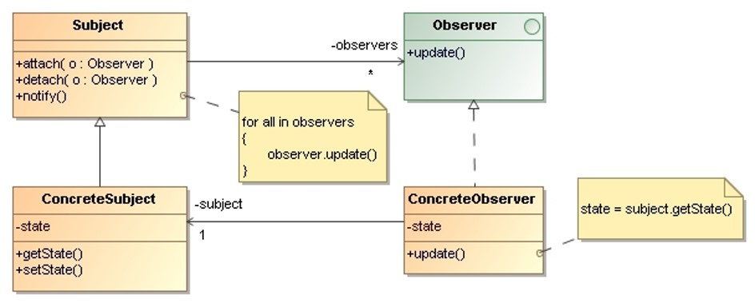
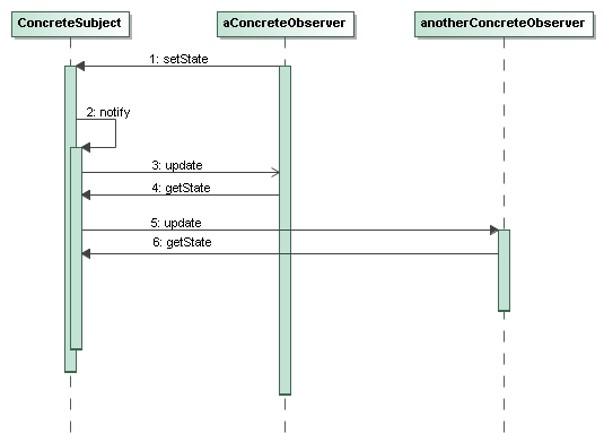

# Observer

> Define a one-to-many dependency between objects so that when one 
> object changes state, all its dependents are notified and updated 
> automatically.

## Applicability

* A change to one object requires changing others, and you don’t 
    know how many objects need to be changed. 

* An object should be able to notify other objects without making 
    assumptions about who these objects are.

## Structure

* `Subject`: Knows its observers. Any number of `Observer` objects may 
    observe a subject. Provides an interface for attaching and detaching 
    `Observer` objects.

* `Observer`: Defines an updating interface for objects that should be 
    notified of changes in a `Subject`.

* `ConcreteSubject`: Stores state of interest to `ConcreteObserver` objects. 
    Sends a notification to its observers when its state changes.

* `ConcreteObserver`: 
    * Maintains a reference to a `ConcreteSubject` object.
    * Stores state that should stay consistent with the `Subject`’s.
    * Implements the `Observer` updating interface to keep its state 
    consistent with the `Subject`’s.

## Collaborations

* `ConcreteSubject` notifies its observers whenever a change occurs that 
    could make its observers’ state inconsistent with its own. 

* After being informed of a change, a `ConcreteObserver` object may query 
    the subject for information. `ConcreteObserver` uses this information 
    to reconcile its state with that of the subject.

## Consequences

* **The observer pattern lets us vary subjects and observers independently**: 
    * We can reuse subjects without reusing their observers, and vice versa.
    * It lets us add observers without modifying the subject or other observers.

* **The coupling between subjects and observers is abstract and minimal**:
    * All a subject knows is that it has a list of observers, each conforming 
        to the simple interface of the abstract observer class.
    * The subject doesn’t know the concrete class of any observer.

* **Support for broadcast communication**:
    * The notification that a subject sends need not specify its receiver. 
        The notification is broadcast automatically to all interested objects 
        that subscribed to it.
    * The subject does not care how many interested objects exist. Its only
        responsibility is to notify its observers. We can add and remove 
        observers at any time.

* **Unexpected updates**:
    Because observers have no knowledge of each other’s presence, they 
    can be blind to the ultimate cost of changing the subject.

## Implementation Issues

* **Observing more than one subject**:
    It might make sense in some situations for an observer to depend 
    on more than one subject. It’s necessary to extend the update 
    interface in such cases to let the observer know which subject 
    is sending the notification. The subject can simply pass itself 
    as a parameter in the update operation.

* **Who triggers the update?**:
    * Let state-setting operations on Subject call notify after they 
        change the Subject’s state.
    * Make clients responsible for calling notify at the right time.
    
* **The push and the pull models**:
    * **Push model**: The subject sends observers detailed information 
        about the change, whether they want it or not.
    * **Pull model**: The subject sends nothing but the most minimal 
        notification, and observers ask for details explicitly thereafter.

* **Specifying modifications of interest explicitly**: We can improve 
    update efficiency by extending the subject’s registration interface 
    to allow registering observers only for specific events of interest.

* We can **combine the interfaces of Subject and Observer** to define an 
    object that acts as both subject and observer. 
    
## Examples 

* _Demo_: [Stock Market](Observer-StockMarket/)
* _Exercise_: [Bean Validation](Observer-BeanValidation-Exercise/) - ([Model solution](Observer-BeanValidation/))
* _Exercise_: [Pubisher - Subscriber](Observer-PublisherSubscriber-Exercise/) - ([Model solution](Observer-PublisherSubscriber/))

## References 

* E. Gamma, R. Helm, R. Johnson, J. Vlissides. **Design Patterns, Elements of Reusable Object-Oriented Software**. Addison-Wesley, 1995
    * Chapter 5: Behavioral Patterns

*Egon Teiniker, 2016-2024, GPL v3.0*

