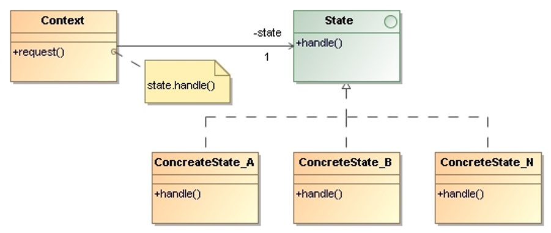

# State

> Allow an object to alter its behavior when its internal state changes. 
> The object will appear to change its class.
 

## Applicability

* An **object’s behavior depends on its state**, and it must change its 
    behavior at run-time depending on that state.

* Operations have large, multipart conditional statements that depend on 
    the object’s state. The state pattern puts each branch of the conditional 
    in a separate class. This let’s you treat the object’s state as an object 
    in its own right that can vary independently from other objects. 

## Structure

* `Context`: Defines the interface of interest to clients. Maintains an 
    instance of a `ConcreteState` subclass that defines the current state. 

* `State`: Defines an interface for encapsulating the behavior associated 
    with a particular state of `Context`.

* `ConcreteState`: Each subclass of State implements a behavior associated 
    with a state of the `Context`.

## Collaborations

* `Context` delegates state-specific requests to the current `ConcreteState` 
    object.

* A context may pass itself as an argument to the `State` object handling 
    the request. This lets the `State` object access the context if necessary.

* `Context` is the primary interface for clients. Clients can configure a 
    context with `State` objects. Once a `Context` is configured, its clients 
    don’t have to deal with the `State` objects directly.

* Either `Context` or the `ConcreteState` subclasses can decide which state 
    succeeds another and under what circumstances.

## Consequences

* **It localizes state-specific behavior and partitions behavior for different 
    states**. The state pattern puts all behavior associated with a particular 
    state into one object. New states and transitions can be added easily by
    defining new subclasses. 

* Introducing separate objects for different states **makes the transitions 
    more explicit**. 

* If `State` objects have no instance variables, then **contexts can share a 
    `State` object**.

## Implementation Issues

* **Who defines the state transitions?** 
    * If the criteria are fixed, then they can be implemented entirely in 
        the Context.

    * It is generally more flexible and appropriate to let the `State` 
        subclasses themselves specify their successor state and when to 
        make the transition.
        
        This requires adding an interface to the `Context` that lets `State` 
        objects set the `Context`’s current state explicitly. A disadvantage 
        of this decentralization is that one `State` subclass will have 
        knowledge of at least one other.

## Examples 

* _Demo_: [Connection](State-Connection/)
* _Demo_: [Light Bulb](State-LightBulb/)
* _Exercise_: [Elevator Control System](State-ElevatorControlSystem-Exercise/) - ([Model solution](State-ElevatorControlSystem/))
* _Exercise_: [Parking Gate](State-ParkingGate-Exercise/) - ([Model solution](State-ParkingGate/))

## References 

* E. Gamma, R. Helm, R. Johnson, J. Vlissides. **Design Patterns, Elements of Reusable Object-Oriented Software**. Addison-Wesley, 1995
    * Chapter 5: Behavioral Patterns

*Egon Teiniker, 2016-2024, GPL v3.0*

