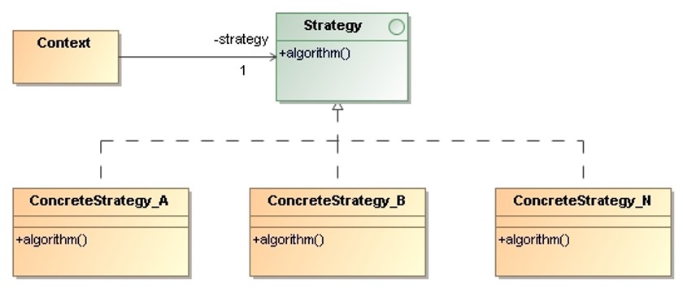

# Strategy

> Define a **family of algorithms**, encapsulate each one, and make them 
> interchangeable. Strategy lets the algorithm vary independently from 
> clients that use it.
 
## Applicability

* If many related classes differ only in their behavior. Strategies provide 
    a way to configure a class with one of many behaviors we need different 
    variants of an algorithm (e.g., space/time trade-off).
* When a class defines many behaviors, and these appear as multiple conditional 
    statements in its operations.

## Structure

* `Strategy`:  Declares an interface common to all supported algorithms.
* `ConcreteStrategy`: Implements the algorithm using the `Strategy` interface.
* `Context`:
    * Is configured with a `ConcreteStrategy` object.
    * Maintains a reference to a `Strategy` object.
    * May define an interface that lets `Strategy` access its data.

## Collaborations

* `Strategy` and `Context` interact to implement the chosen algorithm.  
    A `Context` may pass all data required by the algorithm to the strategy 
    when the algorithm is called. 
    
    Alternatively, the context can pass itself as an argument to `Strategy` 
    operations. That lets the strategy call back on the context as required.

* A `Context` forwards requests from its clients to its `Strategy`.

* Clients usually create and pass a `ConcreteStrategy` object to the context.

## Consequences

* **Hierarchies of `Strategy` classes** define a family of algorithms or behaviors 
    for contexts to reuse. Inheritance can help factor out common functionality 
    of the algorithms.

* Encapsulating the algorithm in separate `Strategy` classes lets us **vary the 
    algorithm independently of its context**, making it easier to switch, understand, 
    and extend.
* The strategy pattern offers an **alternative to conditional statements** for 
    selecting desired behavior.

* The pattern has a potential drawback in that a **client must understand how 
    strategies differ before it can select the appropriate one**. Therefore, 
    the strategy pattern should only be used when the variation in behavior 
    is relevant to clients.

* The `Strategy` interface is shared by all `ConcreteStrategy` classes whether the 
    algorithms they implement are trivial or complex. That means there will be 
    times when the context creates and initializes parameters that never get used.

* Strategies increase the number of objects in an application. 

## Implementation Issues

* **Strategies as template parameters**: This technique is only applicable if
    * the `Strategy` can be selected at compile-time 
    * the `Strategy` does not have to be changed at run-time.

* **Making Strategy objects optional**: The `Context` checks to see if it has a 
    `Strategy` object before accessing it:
    * If there is one, the `Context` uses it normally.
    * If there isn’t a `Strategy`, then `Context` carries out default behavior.

## Examples 

* _Demo_: [Sum of Sequence](Strategy-SumOfSequence/)
* _Exercise_: [Bubble Sort](Strategy-BubbleSort-Exercise/) - ([Model solution](Strategy-BubbleSort/))
* _Exercise_: [Digest](Strategy-Digest-Exercise/) - ([Model solution](Strategy-Digest/))

## References 

* E. Gamma, R. Helm, R. Johnson, J. Vlissides. **Design Patterns, Elements of Reusable Object-Oriented Software**. Addison-Wesley, 1995
    * Chapter 5: Behavioral Patterns

*Egon Teiniker, 2016-2024, GPL v3.0*

