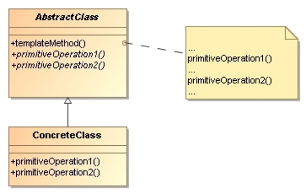

# Template Method

> Define the skeleton of an algorithm in an operation, deferring some steps 
> to subclasses. Template method lets subclasses redefine certain steps of 
> an algorithm without changing the algorithm’s structure.

## Applicability

* To **implement the invariant parts of an algorithm once** and leave it up to 
    subclasses to implement the behavior that can vary.

* When common behavior among subclasses should be factored and localized in 
    a common class to **avoid code duplication**. 
 

## Structure

* `AbstractClass`: 
    Defines **abstract primitive operations** that concrete subclasses define 
    to implement steps of an algorithm.

    **Implements a template method** defining the skeleton of an algorithm. 
    The template method calls primitive operations as well as operations 
    defined in AbstractClass or those of other objects.

* `ConcreteClass`:
    Implements the primitive operations to carry out subclass-specific steps 
    of the algorithm.

## Collaborations

* `ConcreteClass` relies on `AbstractClass` to implement the invariant steps 
    of the algorithm.

## Consequences

* Template methods lead to an inverted control structure that’s sometimes referred 
    to as the **Hollywood principle**, that is “Don’t call us, we’ll call you”.

* Template methods also call **hook operations**, which **provide default behavior** 
    that subclasses can extend if necessary. A hook operation often does nothing by 
    default. It’s important for template methods to specify which operations are hooks 
    (may be overridden) and which are abstract operations (must be overridden). 

## Implementation Issues

* **Using access control**:
    The **primitive operations** that a template method calls can be declared as 
    **protected** members. The **template method** itself should not be overridden, 
    therefore we can make the template method final.

* **Minimizing primitive operations**: An important goal in designing template methods 
    it to minimize the number of primitive operations that a subclass must override to 
    flesh out the algorithm. 

## Examples 

* _Exercise_: [Bubble Sort](TemplateMethod-BubbleSort-Exercise/) - ([Model solution](TemplateMethod-BubbleSort/))

* _Exercise_: [List Processor](TemplateMethod-ListProcessor-Exercise/) - ([Model solution](TemplateMethod-ListProcessor/))

* _Exercise_: [Order Service](TemplateMethod-OrderService-Exercise/) - ([Model solution](TemplateMethod-OrderService/))

## References 

* E. Gamma, R. Helm, R. Johnson, J. Vlissides. **Design Patterns, Elements of Reusable Object-Oriented Software**. Addison-Wesley, 1995
    * Chapter 5: Behavioral Patterns

*Egon Teiniker, 2016-2024, GPL v3.0*

