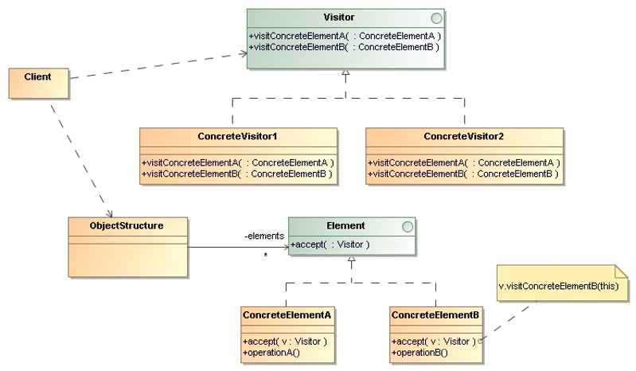
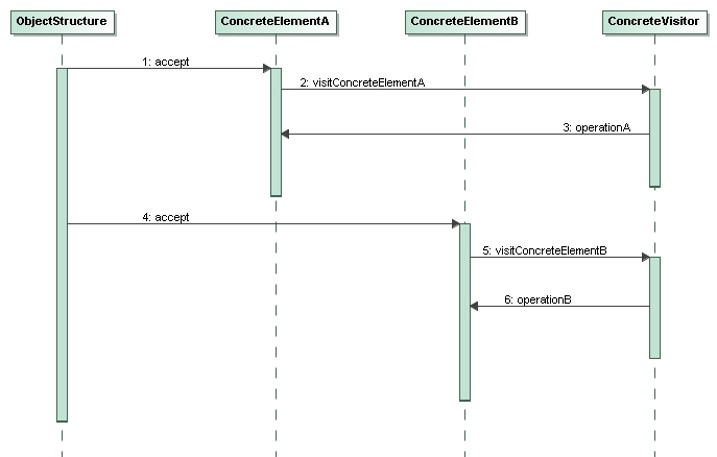

# Visitor

> Represent an operation to be performed on the elements of an object 
> structure. Visitor lets you define a new operation without changing 
> the classes of the elements on which it operates.
 

## Applicability

* Many distinct and unrelated operations need to be performed on objects 
    in an object structure.
* The classes defining the object structure rarely change, but we often 
    want to define new operations over the structure.

## Structure

* `Visitor`: Declares a `visit()` operation for each class of `ConcreteElement` 
    in the `ObjectStructure`. The operation’s name and signature identifies 
    the class that sends the visit request to the `Visitor`.

* `ConcreteVisitor`: Implements each operation declared by `Visitor`. 
    Each operation implements a fragment of the algorithm defined for the
    corresponding class of object in the structure.
    
    `ConcreteVisitor` provides the context for the algorithm and stores its 
    local state. This state often accumulates results during the traversal 
    of the structure.

* `Element`: Defines an `accept()` operation that takes a `Visitor` as an 
    argument.

* `ConcreteElement`: Implements an `accept()` operation that takes a 
    `Visitor` as an argument.

* `ObjectStructure`:
    * Can enumerate its elements.
    * May provide a high-level interface to allow the `Visitor` to visit 
        its elements.
    * May either be a composite or a collection such as a list or a set.

## Collaborations

* A client must create a `ConcreteVisitor` object and then traverse the 
    object structure, visiting each element with the visitor.
    
* When an element is visited, it calls the `visitor()` operation  that 
    corresponds to its class. The element supplies itself as an argument 
    to this operation to let the visitor access its state, if necessary.

## Consequences

* **`Visitor` makes adding new operations easy**: We can define a new operation 
    over an object structure simply by adding a new visitor. In contrast, 
    if you spread functionality over many classes, then we must change each 
    class to define a new operation.

* **Adding new `ConcreteElement` classes is hard**: Each new `ConcreteElement` 
    gives rise to a new abstract operation on `Visitor` and a corresponding implementation in every `ConcreteVisitor` class.

* **Visiting across class hierarchies**: An iterator can’t work across object
    structures with different types of elements. Visitor doesn’t have this
    restriction.

* **Accumulating state**: Visitors can accumulate state as they visit each 
    element in the object structure. Without a visitor, this state would be 
    passed as extra arguments to the operations that perform the traversal, 
    or they might appear as global variables.

* **Breaking encapsulation**: The visitor pattern often forces you to provide 
    public operations that access an element’s internal state, which may 
    compromise its encapsulation.

## Implementation Issues

We can put responsibility for traversal in any of three places:
* In the **object structure**: A collection will simply iterate over its 
    elements, calling the `accept()` operation on each. A composite will 
    commonly traverse itself by having each `accept()` operation traverse 
    the element’s children and call `accept()` on each of them recursively.

* In the **Visitor**: We could use either an internal or external iterator,
    depending on what is available and what is most efficient.
    
* In a **separate iterator**: With this approach, we’ll end up duplicating 
    the traversal code in each `ConcreteVisitor` for each aggregate 
    `ConcreteElement`.

## Examples 

* _Demo_: [File System](Visitor-FileSystem/)
* _Demo_: [File System (Accept)](Visitor-Accept-FileSystem/)

* _Exercise_: [Apple Tree](Visitor-AppleTree-Exercise/) - ([Model solution](Visitor-AppleTree/))
* _Demo_: [Apple Tree (Accept)](Visitor-Accept-AppleTree/)

* _Exercise_: [Container](Visitor-Container-Exercise/) - ([Model solution](Visitor-Container/))

## References 

* E. Gamma, R. Helm, R. Johnson, J. Vlissides. **Design Patterns, Elements of Reusable Object-Oriented Software**. Addison-Wesley, 1995
    * Chapter 5: Behavioral Patterns

*Egon Teiniker, 2016-2024, GPL v3.0*

