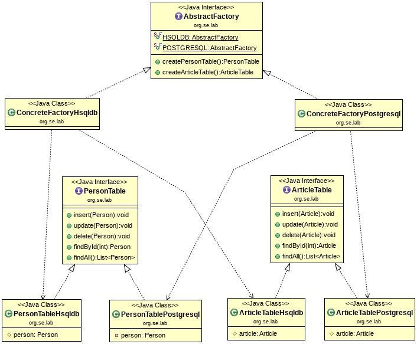

# Example: Abstract Factory - TableFamily

This Abstract Factory pattern example shows how a family of related objects can be instantiated.



The products are classes that simulate access to a database and can be grouped into two 
families:
* Postgresql product family: **PersonTablePostgresql** and **ArticleTablePostgresql**

* Hsqldb product family: **PersonTableHsqldb** and **ArticleTableHsqldb**

Each product is defined by an interface that has an implementation class per product family.

A public interface named **Abstract Factory** defines one Factory Method per product. 
The return value of a Factory Method is the type of the corresponding product interface.

For each product family a concrete factory has been implemented. 
Because every concrete factoty implements the *AbstractFactory* interface, all Factory Methods 
must be implemented.

The **ConcreteFactoryPostgress** implements all Factory Methods so that the Postgress variants of 
the products are instantiated.

The **ConcreteFactoryHsqldb** implements all Factory Methods to instantiate the Hsqldb variants 
of the products.

```java
    @Test
    public void testConcreteFactoryPostgreSQL()
    {
        AbstractFactory factory = AbstractFactory.POSTGRESQL;

        PersonTable personTable = factory.createPersonTable();        
        personTable.insert(new Person(7, "Franz", "Kafka", "fk@fhj.at"));
        assertEquals(personTable.findById(7).getFirstName(), "Franz");

        ArticleTable articleTable = factory.createArticleTable();
        articleTable.insert(new Article(3, "GoF Book", 34.80));
        assertEquals(articleTable.findById(3).getDescription(), "GoF Book");
    }
```
As shown in the test case, a client uses the constants **AbstractFactory.POSTGRESQL** and **AbstractFactory.HSQLDB** to 
get an instance of a concrete factory.

Note that a client only uses references from interface types. 
All implementation classes (concrete factories as well as products) are **package private**.

In order to add a new product family in this example, a new variant must be created for each 
product and these new product variants must be instantiated via a new concrete factory.


*Egon Teiniker, 2019, GPL v3.0*