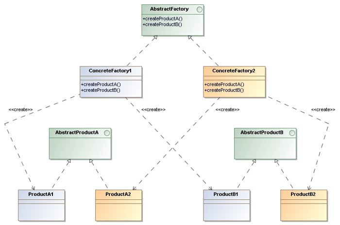

# Abstract Factory

> Provide an interface for **creating families of related or dependent objects** 
> without specifying their concrete classes.

## Applicability

* A system should be independent of how its products are created, composed, and represented.

* A system should be configured with one of multiple families of products.

## Structure

* `AbstractFactory`: Declares an interface for operations that create abstract product objects.

* `ConcreteFactory`: Implements the operations to create concrete product objects.

* `AbstractProduct`: Declares an interface for a type of product object.

* `ConcreteProduct`: Defines a product object to be created by the corresponding concrete factory 
    and implements the `AbstractProduct` interface.

## Consequences

* The abstract factory pattern **isolates clients from implementation classes**. Clients 
    manipulate instances through their abstract interfaces.

* Because an abstract factory **creates a complete family of products**, the whole product 
    family can be **changed at once**.

* The abstract factory pattern **promotes consistency** among products.

* Extending abstract factories to produce new kinds of `Products` isn’t easy because 
    the `AbstractFactory` interface fixes the set of products that can be created.

## Implementation Issues

* An application typically needs **only one instance of a ConcreteFactory** per product 
    family. So, it’s usually best implemented as a `Singleton`.

* `AbstractFactory` only declares an interface for creating products. It’s up to 
    `ConcreteFactory` subclasses to actually create them. The most common way to do this 
    is to define a factory method for each product.

* `AbstractFactory` usually defines a different operation for each kind of product 
    it can produce. A more flexible but less safe design is to add a **parameter 
    to operations that create objects**.

## Examples

* [TableFamily](AbstractFactory-TableFamily)
* _Exercise_: [SerializerFamily](AbstractFactory-SerializerFamily-Exercise) - ([Model solution](AbstractFactory-SerializerFamily))

## References 

* E. Gamma, R. Helm, R. Johnson, J. Vlissides. **Design Patterns, Elements of Reusable Object-Oriented Software**. Addison-Wesley, 1995
    * Chapter 3: Creational Patterns

*Egon Teiniker, 2016-2024, GPL v3.0*
