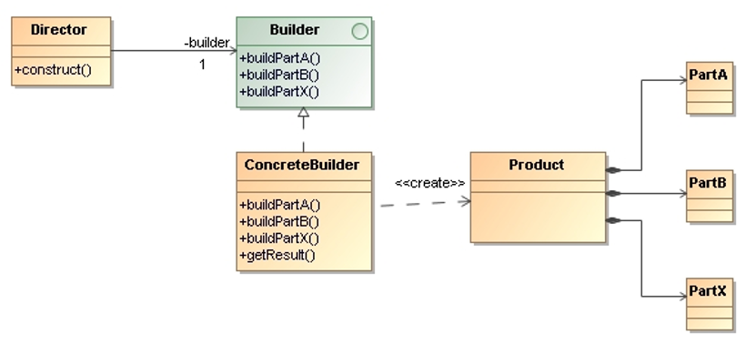
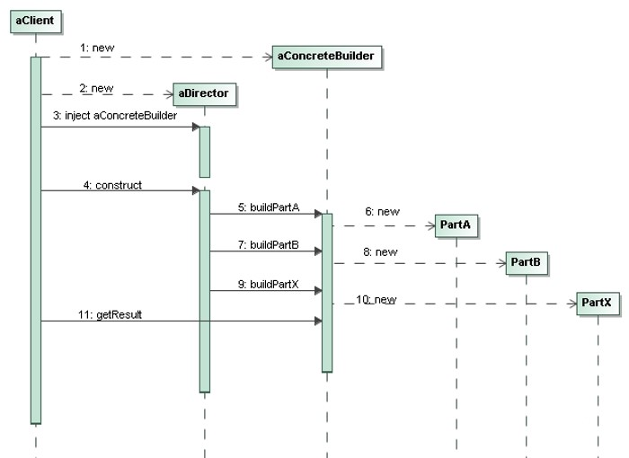

# Builder

> **Separate the construction** of a complex object **from its representation** 
> so that the same construction process can create different representations.

## Applicability

* The **algorithm for creating a complex object** should be independent of the parts 
    that make up the object and how they are assembled.

* The construction process must allow **different representations** for the object that is constructed.

## Structure

* `Builder`: Specifies an abstract interface for creating parts of a `Product` object.

* `ConcreteBuilder`: Constructs and assembles parts of the product by implementing the `Builder` interface.

* `Director`: Constructs an object using the `Builder` interface.

* `Product`: Represents the complex object under construction. 

## Collaborations

* The `Client` creates the `Director` object and configures it with the desired 
    `ConcreteBuilder` object.

* The `Director` notifies the `Builder` whenever a part of the product should be built.

* `Builder` handles requests from the `Director` and adds parts to the `Product`.

* A `Client` retrieves the `Product` from the `Builder`.

## Consequences

* **It lets us vary a product’s internal representation**: Because the product is 
    constructed through an abstract interface, all you have to do to change the product’s 
    internal representation is define a new kind of builder.

* **It isolates code for construction and representation**: The builder pattern improves 
    modularity by encapsulating the way a complex object is constructed and represented.

* **It gives you a finer control over the construction process**: The builder pattern 
    constructs the product step by step under the director’s control.

## Implementation Issues

* **Assembly and construction interface**: The `Builder` interface must be general enough 
    to allow the construction of products for all kinds of concrete builders.

* **Why no abstract class for products?** In the common case, the products produced by the 
    concrete builders differ so greatly in their representations that there is little to 
    gain from giving different products a common parent class.

## References 

* E. Gamma, R. Helm, R. Johnson, J. Vlissides. **Design Patterns, Elements of Reusable Object-Oriented Software**. Addison-Wesley, 1995
    * Chapter: 

*Egon Teiniker, 2016-2024, GPL v3.0*

