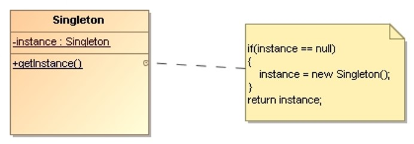

# Singleton

> Ensure a class only has **one instance** and provide a **global point of access** to it.

## Applicability

* There must be exactly one instance of a class, and it must be accessible to clients from 
    a well-known access point.
* When the sole instance should be extensible by subclassing, and clients should be able to 
    use an extended instance without modifying their code.

## Structure

* `Singleton`: 
    * Defines a static `getInstance()` operation that lets clients access its unique instance.
    * May be responsible for creating its own unique instance.

## Consequences

* Because the `Singleton` class **encapsulates its sole instance**, it can have strict 
    control over how and when clients access it.

* The `Singleton` class may be **subclassed**, and it’s easy to configure an application 
    with an instance of this extended class even at run-time.

* The pattern makes it easy to change your mind and allow **more than one instance** 
    of the Singleton class. Moreover, we can use the same approach to control the number 
    of instances that the application uses.

## Implementation Issues

* A common way to implement a Singleton is to hide the operation that creates the instance 
    behind a **static operation** that guarantees only one instance is created.

* **Subclassing** the Singleton class. The variable that refers to the singleton instance 
    must get initialized with an instance of the subclass.
    * Code it in the singleton’s getInstance() method.
    * Use a registry of singletons.

## Examples

* [Logger](Singleton-Logger)
* [Implementation Variants](Singleton-ImplementationVariants)
* _Exercise_: [Registry](Singleton-Registry-Exercise) - ([Model solution](Singleton-Registry))

## References 

* E. Gamma, R. Helm, R. Johnson, J. Vlissides. **Design Patterns, Elements of Reusable Object-Oriented Software**. Addison-Wesley, 1995
    * Chapter 3: Creational Patterns

*Egon Teiniker, 2016-2024, GPL v3.0*
    