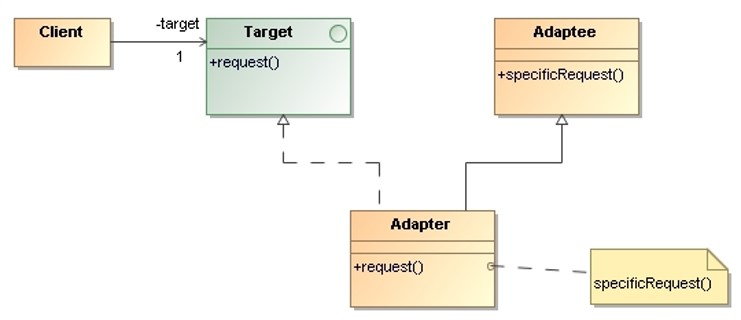
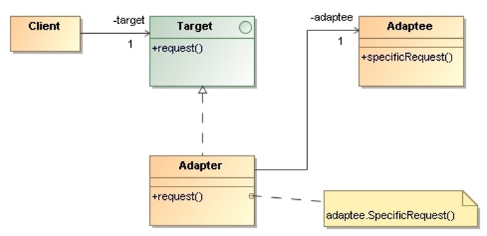
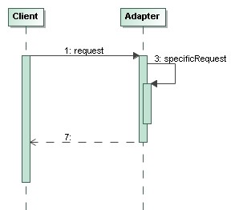
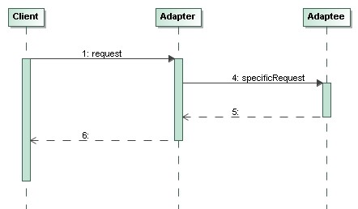

# Adapter

> **Convert the interface of a class** into another interface clients 
> expect. Adapter lets classes work together that couldn’t otherwise 
> because of incompatible interfaces.

## Applicability

* We want to **use an existing class**, and its interface does not match 
    the one we need.

* We want to **create a reusable class** that cooperates with unrelated 
    or unforeseen classes, that is, classes that don’t necessarily have 
    compatible interfaces.

## Structure

* **Class Adapter:**

* **Object Adapter:**

* `Client`: Collaborates with objects conforming to the `Target` interface.

* `Target`: Defines the **domain-specific interface** that `Client` uses.

* `Adaptee`: Defines an existing interface that needs adapting.

* `Adapter`: Adapts the interface of `Adaptee` to the `Target` interface.

## Collaborations

* **Class Adapter:**

* **Object Adapter:**

* Clients call operations on an `Adapter` instance. In turn, the adapter 
    calls `Adaptee` operations that carry out the request.

## Consequences

A **class adapter**:
    * adapts `Adaptee` to `Target` by **committing to a concrete `Adaptee` class**. 
    Therefore, a class adapter won’t work when we want to adapt a class and all 
    its subclasses.
    * lets adapter **override some of Adaptee’s behavior**, since `Adapter` is 
    a subclass of `Adaptee`.
    * introduce **only one object**, and no additional pointer indirection is 
    needed to get to the `Adaptee`.

An **object adapter**:
    * lets a single `Adapter` **work with many `Adaptees`** (the Adaptee itself 
    and all of its subclasses).
    * The `Adapter` can also add functionality to all `Adaptees` at once.
    * Makes it **harder to override Adaptee behavior**. It will require 
    subclassing `Adaptee` and making `Adapter` refer to the subclass rather 
    than the Adaptee itself.

## Implementation Issues

* The amount of work `Adapter` does depend on how similar the `Target` interface 
    is to the `Adaptee`.
    
* There is a **spectrum of possible work**, from simple interface conversion 
    (e.g., changing the names of operations) to supporting an entirely 
    different set of operations.
 
## Examples 

* _Demo_: [Object Adapter: CustomLogger](Adapter-CustomLogger)
* _Demo_: [Class Adapter: ArticleDAO]()
* _Exercise_: [ArticleDAO](Adapter-ArticleDAO-Exercise) - ([Model solution](Adapter-ArticleDAO))
* _Exercise_: [DigestService](Adapter-DigestService-Exercise) - ([Model solution](Adapter-DigestService))

## References 

* E. Gamma, R. Helm, R. Johnson, J. Vlissides. **Design Patterns, Elements of Reusable Object-Oriented Software**. Addison-Wesley, 1995
    * Chapter 4: Structural Patterns

*Egon Teiniker, 2016-2024, GPL v3.0*

