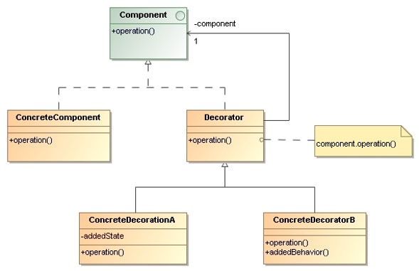
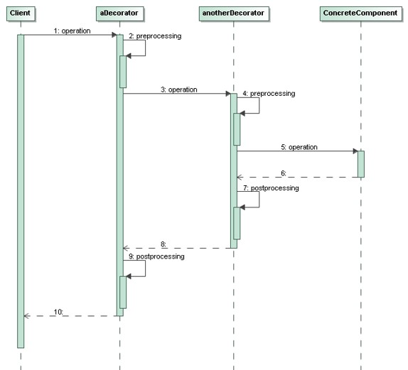

# Decorator

> Attach additional responsibilities to an object dynamically. 
> Decorators provide a **flexible alternative to subclassing** 
> for extending functionality.

## Applicability

* To add responsibilities to individual objects dynamically and 
    transparently – without affecting other objects.

* For responsibilities that can be withdrawn.

* When extensions by subclassing is impractical.

## Structure

* `Component`: Defines the interface for objects that can have 
    responsibilities added to them dynamically.

* `ConcreteComponent`: Defines an object to which additional 
    responsibilities can be attached.

* `Decorator`: Maintains a reference to a `Component` object and 
    defines an interface that conforms to `Component`’s interface.

* `ConcreteDecorator`: Adds responsibilities to the component.

## Collaborations

* A `Decorator` forwards requests to its `Component` object. 
    
* It may optionally perform **additional operations before and after 
    forwarding** the request.
 

## Consequences

* **More flexibility than static inheritance**. With decorators, 
    responsibilities can be added and removed at run-time simply 
    by attaching and detaching them. Decorators also make it easy 
    to add a property twice.

* Decorator offers a **pay-as-you-go approach to adding responsibilities**. 
    We can define a simple class and add functionality incrementally with 
    `Decorator` objects. As a result, an application needn’t pay for features 
    it doesn’t use.

* A **decorated component is not identical to the component itself**. 
    Hence, we shouldn’t relay on object identity when we use decorators. 

## Implementation Issues

* **Interface conformance**: A decorator object’s interface must conform 
    to the interface of the component it decorates.

* **Omitting the `Decorator` class**: There’s no need to define a `Decorator` 
    class when we only need to add one responsibility. In that case, we can 
    merge `Decorator`’s responsibility for forwarding requests to the component 
    into the `ConcreteDecorator`.
    

## Examples

* _Demo_: [TableMonitor](Decorator-TableMonitor)
* _Exercise_: [FileName](Decorator-FileName-Exercise) - ([Model solution](Decorator-FileName))

## References 

* E. Gamma, R. Helm, R. Johnson, J. Vlissides. **Design Patterns, Elements of Reusable Object-Oriented Software**. Addison-Wesley, 1995
    * Chapter 4: Structural Patterns

*Egon Teiniker, 2016-2024, GPL v3.0*

