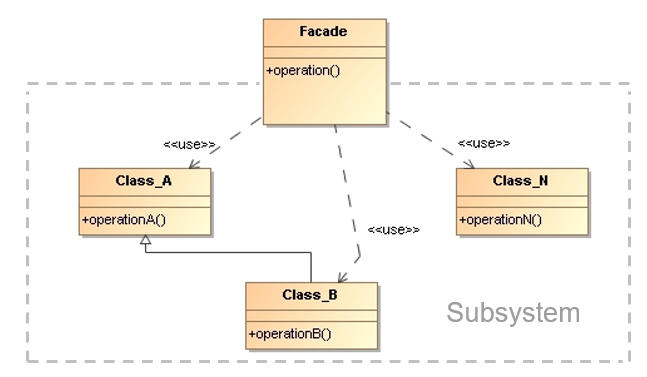

# Facade

> Provide a **unified interface to a set of interfaces in a subsystem**. 
> Facade defines a higher-level interface that makes the subsystem 
> easier to use.

## Applicability

* We want to provide a **simple interface to a complex subsystem**. 

* We introduce a facade to **decouple the subsystem from clients** 
    and other subsystems, thereby promoting subsystem independence 
    and portability.

## Structure

* `Facade`: 
    * Knows which subsystem classes are responsible for a request.
    * **Delegates client requests** to appropriate subsystem objects.

* `Subsystem classes`:
    * Implement subsystem **functionality**.
    * Handle work assigned by the facade object.
    * Have **no knowledge of the facade**, they keep no references to it.

## Collaborations

* `Clients` communicate with the subsystem by **sending requests to `Facade`**, 
    which forwards them to the appropriate subsystem objects. Although the 
    subsystem objects perform the actual work, the facade may have to do work 
    of its own to **translate its interface to subsystem interfaces**.

* `Clients` that use the facade don’t have to access its subsystem objects 
    directly.

## Consequences

* Facade **shields clients from subsystem components**, thereby reducing 
    the number of objects that clients deal with and making the subsystem 
    easier to use.

* Facade promotes **weak coupling** between the subsystem and its clients. 
    Weak coupling lets you vary the components of the subsystem without 
    affecting its clients.

## Implementation Issues

* **Reducing client-subsystem coupling**: The coupling between clients and 
    the subsystem can be reduced even further by **making facade an abstract 
    class** with concrete subclasses for different implementations of a subsystem. 
    This abstract coupling keeps clients from knowing which implementation 
    of a subsystem is used.

* **Public versus private subsystem classes**: The public interface to 
    a subsystem consists of classes that all clients can access; 
    the private interface is just for subsystem extenders. The facade 
    class is part of the public interface. 

## Examples 

  * _Demo_: [CalculatorService](Facade-CalculatorService)
  * _Exercise_: [DigestService](Facade-DigestService-Exercise) - ([Model solution](Facade-DigestService))

## Related Patterns

* **Remote Facade [PoEAA]**: Provides a coarse-grained facade on fine-grained 
    objects to improve efficiency over a network.
    * Any **inter-process call is orders of magnitude more expensive** than 
        an in-process call – even if both processes are on the same machine.
    * As a result, any object that is intended to be used as a **remote object** 
        needs a **coarse-grained interface** that minimizes the number of calls 
        needed to get something done.
    * A remote facade is a coarse-grained facade over a web of fine-grained 
        objects.

## References 

* E. Gamma, R. Helm, R. Johnson, J. Vlissides. **Design Patterns, Elements of Reusable Object-Oriented Software**. Addison-Wesley, 1995
    * Chapter 4: Structural Patterns

* [PoEAA] Martin Fowler. **Patterns of Enterprise Application Architecture**
    Addison-Wesley, 2003

*Egon Teiniker, 2016-2024, GPL v3.0*

