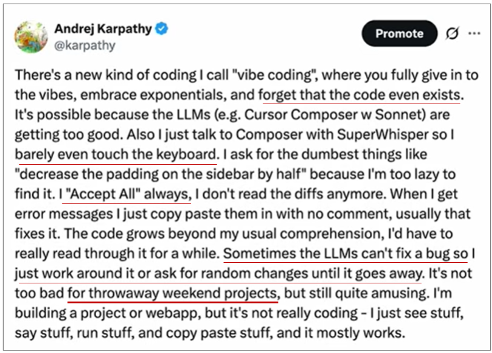
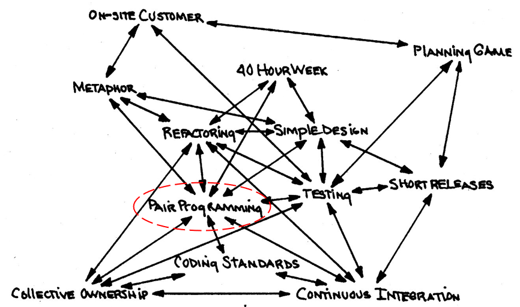
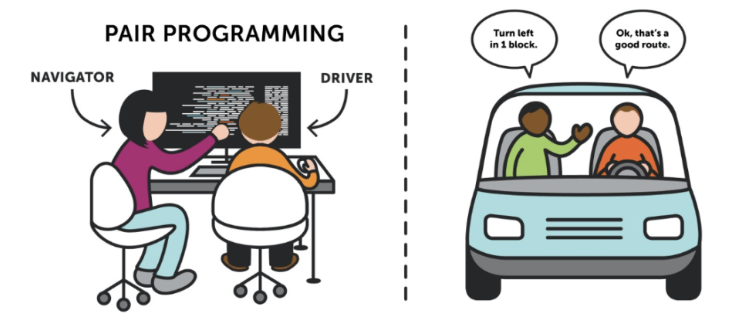
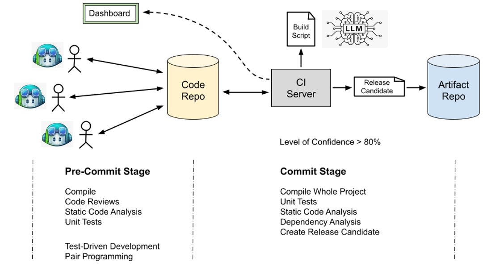

# Generative AI in Software Engineering

With the availability of LLMs in chats, IDE extensions, and coding agents,
the question arises whether and in what form software development should still
be performed manually.

The following sections discuss different approaches from practice.

## Vibe Coding

Andrej Karpathy coined this term. He describes this approach in a tweet: 

Note his classification in this tweet: 
**It is not too bad for throwaway weekend projects**.

The concept of specifying functionality and outsourcing the implementation 
is not new...

## Software Development Outsourcing

> Software development outsourcing is the practice of **hiring an external 
> company or individual (often in a different country or region) to handle software 
> development tasks** instead of using in-house teams.

Common challenges encountered in practice include:

* **Communication Challenges**: Hard to specify in human language.

* **Quality Control**: Outsourced teams may not adhere to the same quality 
    standards or coding practices.

* **Security and Privacy Risks**: Sharing sensitive data with third-party 
    vendors increases the risk of data breaches.

* **Loss of Control**: Outsourcing can mean less direct control over project 
    management, timelines, and deliverables.

* **Integration and Maintenance Issues**: The outsourced product may not 
    integrate well with existing systems if there's poor documentation 
    or lack of internal understanding.

## LLM Chatbots 

From the use of **LLM Chatbots** (like ChatGPT, Gemini, Claude, DeepSeek, etc.), 
the following observations can be derived:

* The same prompt yields different results repeatedly (**non-deterministic behavior**).

* Not all results are correct (**hallucinations**).

* The quality of the answer depends on the quality of the prompt (**prompt engineering**).

* Handling source code is cumbersome (**copy + paste**).

From this, the following conclusions can be drawn:

* LLMs should not be viewed as tools (e.g., compilers), but rather as 
    **colleagues** who occasionally make mistakes from time to time.

* The **human developer is responsible** for delivering functioning 
    software. To minimize the risk of using LLMs, good specifications 
    (prompting), good verification techniques (code reviews, testing), 
    and iterative development are required.

* **Agile development processes** are well-suited for integrating LLMs 
    into the development workflow.

* **CI/CD pipelines** are particularly effective for performing 
    verification and validation.

## Pair Programming

**Extreme Programming (XP)** was summarized by Kent Beck in the year 2000 
in a thin book.

As part of Extreme Programming, **Pair Programming** is a software 
development technique in which two programmers work together on the same 
computer to complete a task. It involves two roles:

* The **driver** is responsible for writing the code, while 

* the **navigator** reviews each line of code, provides feedback, and thinks
    strategically about the overall direction of the program.

In pair programming, the two programmers **collaborate in real time**, 
discussing and solving problems together. They **switch roles frequently**, 
allowing both individuals to actively participate in the coding process. 

## Continuous Integration

> **Continuous Integration (CI)** is a software development practice where 
> members of a team integrate their work frequently, usually each person 
> integrates at least daily – leading to multiple integrations per day.

### Pre-Commit Stage 

In the pre-commit stage, developers create the **design**, the **implementation** 
and **test cases** in cross functional teams.

Each developer works on his own computer and checks the changes into the code 
repository at least **once a day**.

Following an agile development approach, the following practices are employed:

* **Cross-Functional Team**

* **Test-Driven Development** 

* **Pair Programming (with LLMs)**

### Commit Stage 

The Commit Stage is where we get fast, efficient feedback on any changes, so 
that the developer gets a high level of confidence that the code does what 
they expect it to. 

> Commit Stage tests should provide quality feedback to the developer 
> within 5 minutes.

The Commit Stage is complete when all the technical, developer-centred 
tests pass.
Now the developer has a **high level (`>80%`) confidence** tht their code 
does what they expect it to.

**The output of a successful Commit Stage is a Release Candidate**.

## Using GitHub Copilot 

To conduct pair programming with LLMs efficiently, the interface between 
developer and LLM must be as efficient as possible. A promising approach is 
the integration of LLMs and IDEs.

There are several products available for this purpose. Here, **GitHub Copilot** 
is used for the following reasons:

* GitHub Copilot is available as an **extension for multiple IDEs** (VS Code, IntelliJ).

* GitHub Copilot **supports various language models** (GPT, Claude, Gemini, Grok).

* GitHub Copilot is **free for students**:
    [Access GitHub Copilot for free as a student](https://docs.github.com/en/copilot/how-tos/copilot-on-github/set-up-copilot/enable-copilot/set-up-for-students)

## References

* [YouTube (Andrej Karpathy): Software Is Changing (Again)](https://youtu.be/LCEmiRjPEtQ?si=gE3SJA1zvM71uy2g)

* Kent Beck. **Extreme Programming Explained**. Addison-Wesley, 2000

*Egon Teiniker, 2024-2026, GPL v3.0*