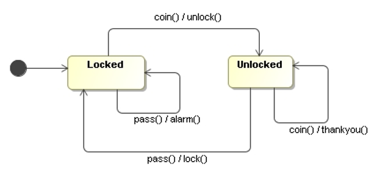

# UML State Machine Diagram

In object-oriented approaches, state machine diagrams are used to **show the lifetime behavior of a single object**.

## References
* Martin Fowler. **UML Distilled**. Addison-Wesley, 3rd Edition, 2004
    * Chapter 10: State Machine Diagrams

*Egon Teiniker, 2016-2023, GPL v3.0*