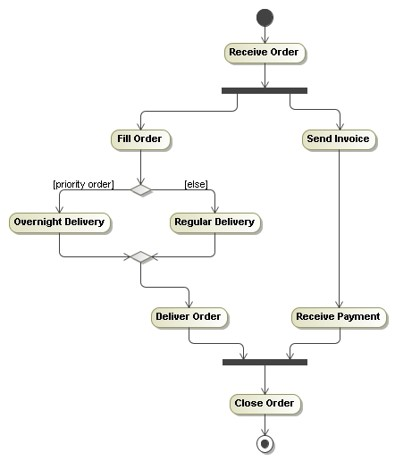
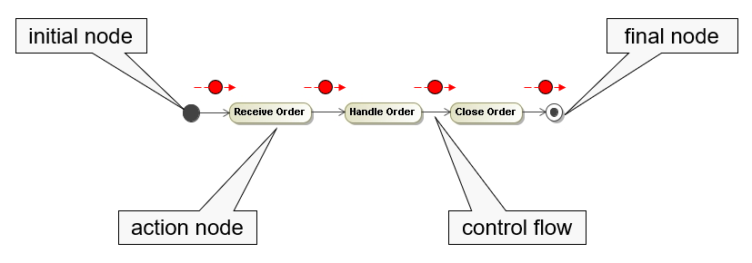
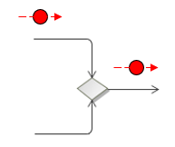
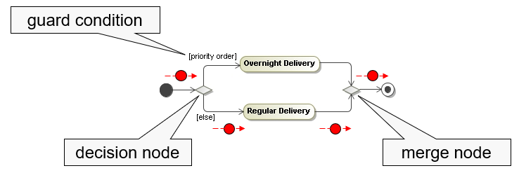
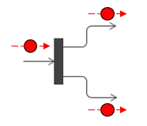
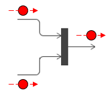
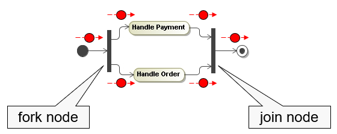
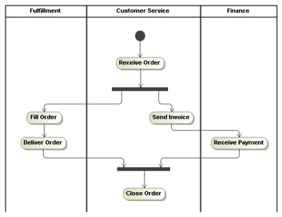

# UML Activity Diagram

Activity diagrams are a technique to **describe procedural logic**, business process, and workflow.

## Nodes and Edges

Activities are networks of nodes connected by edges.

There are three **categories of nodes**:
* **Action nodes**: represent discrete units of work that are atomic within the activity.
* **Control nodes**: control the flow through the activity.
* **Object nodes**: represents objects used in the activity.

**Edges** represent flow through the activity:
* **Control flows**: represent the flow of control through the activity.
* **Object flows**: represents the flow of objects through the activity.

## Activity Semantics

Activity diagrams model behavior by using the **token game**.
This game describes the flow of tokens around a network of nodes and edges according to specific rules.

The **state of the system** at any point in time is determined by the disposition of its tokens.
Tokens are moved from a source node to a target node across an edge.

Movement of a token is subject to conditions, and it can only occur when all of the conditions are satisfied.
The conditions vary depending on the type of node.

## Action Nodes

Action nodes perform a logical AND on their input tokens – the node is not ready to execute until tokens are present
on all of its input ages.
When the action node has finished execution, the node simultaneously offers tokens on all of its output edges.
Activity diagrams are inherently concurrent.

There are different types of action nodes:

* **Call action node**: The most common type of action node is the call action node.
  This type of node can invoke an activity, a behavior, or an operation.
  
  

* **Accept time event action node**: This type of node has a time expression, and it generates
  time events when the expression becomes true.

  

* **Send signal action node**: The send signal action sends a signal asynchronous (the sender does
  not wait for confirmation of signal receipt).

  

* **Accept event action node**: This node waits for asynchronous events and offers them on its single output edge.

  

## Control Nodes

Control nodes manage the flow of control within an activity:

* **Initial nodes**: The initial node is the point at which flow starts when an activity is invoked.
  An activity may have more than one initial node.
  In that case, flows start at all of the initial nodes simultaneously and execute concurrently.

  

* **Final nodes**: The activity final node stops all flows within an activity.
  An activity may have many final nodes, and the first one to be activated terminates all other
  flows and the activity itself.

  

  _Example_: Initial and final nodes

  

* **Decision node**: A decision node has one input edge and two or more alternate
  output edges. A token arriving at the input edge will be offered to all of the
  output edges but will traverse at most one of them.
  Each of the output edges is protected by a **guard condition** such that the
  edge will accept a token if, and only if, the guard condition evaluates to true.

  

* **Merge node**: Merge nodes have two or more input edges and a single output edge.
  All tokens offered on the incoming edges are offered on the outgoing edge and there
  is no modification of the flow or the tokens.

  

  _Example_: Decision and Merge

  

  Note that the keyword `else` can be used to specify the edge traversed if none of the guard conditions is true.

* **Fork node**: We can create concurrent flows within an activity by using a fork node
  to split a single flow into multiple concurrent flows.
  A fork node has one incoming edge and two or more outgoing edges.
  Tokens arriving the incoming edge are duplicated and offered on all of the outgoing
  edges simultaneously. This splits the single incoming flow into multiple parallel
  outgoing flows.

  

* **Join node**: Join nodes have multiple incoming edges and a single outgoing edge.
  They synchronize flows by offering a token on their single output edge when there is
  a token on all of their input edges.
  They perform a logical AND on their input edges.
  The join node synchronizes concurrent flows because it waits for a token from each
  of the concurrent actions.

  

  _Example_: Fork and Join

  
  
  When we model join nodes, it is important to ensure that all of the 
  input edges to the join will receive a token!

## Object Nodes

Object nodes are nodes that indicate that **instances of a particular classifier** are available at a specific
point in the activity. The input and output edges of object nodes are **object flows**.
These are flows that represent the movement of objects around the activity.
The objects themselves are created and consumed by action nodes.

When an object node receives an object token on one of its input edges, it offers this token on all of its
output edges simultaneously and these edges compete for the token. The key point is that there is still only
one token - the token is not replicated on the edges.
The first edge to accept the token gets it.

_Example_: Object node and object flow

## Activity Partitions

We can divide an activity diagram into partitions, which show which actions one class or organization unit carries out.

## When to Use Activity Diagrams

The great strength of activity diagrams lies in the fact that they support and encourage **parallel behavior**.
This makes them a great tool for **work flow and process modeling**.

When using UML as a programming language or as blueprint, activity diagrams represent an important technique
to represent **behavioral logic**.

Activity diagrams are also used to **describe a use case**. The danger of this approach is that often, domain
experts don’t follow them easily.

## References
* [YouTube: All About UML Activity Diagrams](https://youtu.be/Wf_xlagfHmg)

* [Activity Diagram in UML: Symbol, Components & Example](https://www.guru99.com/uml-activity-diagram.html)

* Martin Fowler. **UML Distilled**. Addison-Wesley, 3rd Edition, 2004
  * Chapter 11: Activity Diagrams

* Robert C. Martin. **UML for Java Programmers**. Prentice Hall, 2003

*Egon Teiniker, 2020-2023, GPL v3.0*  
