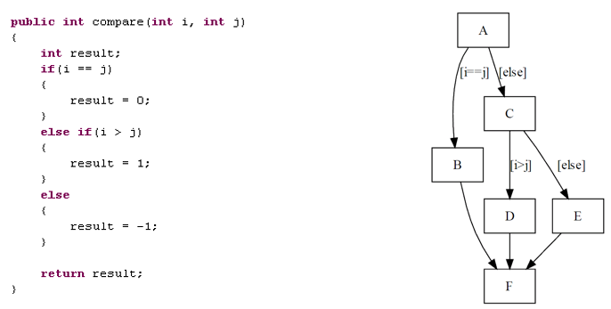
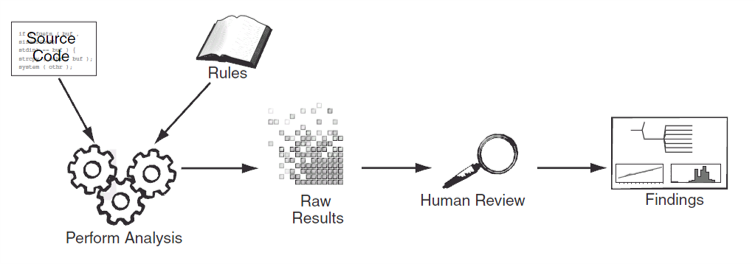
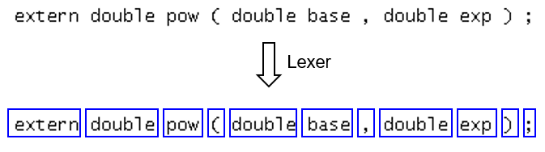
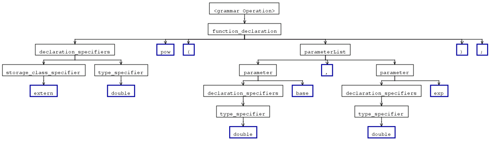
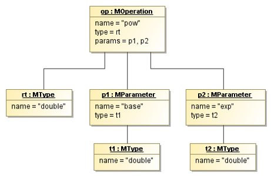

# Static Code Analysis

Together, static code analysis and software metrics enable developers to maintain 
cleaner, more efficient, and more reliable codebases, ultimately leading to better 
software quality and performance.

## Software Metrics 
A software metric is a measure of some property of a piece of software or its 
specifications.

"**You can’t control what you can't measure.**" (Tom DeMarco)

**Measurement** is the empirical, objective assignment of numbers, according to a rule 
derived from a model or theory, to attributes of objects or events with the intent 
of describing them.

### Complexity Metrics

Complexity metrics describe the relationships between design and implementation 
and software quality.

* **Method Lines of Code (MLOC)**: 
	Number of non-blank and non-comment lines inside method bodies.
    
    _Code Smells_: Long Method, Large Class 

* **Number of Attributes**: Total number of attributes of a class.
	
    _Code Smells_: Large Class

* **Number of Methods**: Total number of methods of a class.
	
    _Code Smells_: Large Class

### Cyclomatic Complexity
Thomas McCabe created a metric called Cyclomatic Complexity, which measures 
program and unit complexity in terms of control flows, specifically branching.

> The Cyclomatic Complexity number tells us the number of unique paths 
> through the graph, which is equal to the number of tests needed to 
> cover the control flow graph.

McCabe recommends that **no program module should exceed a cyclomatic complexity of 10**.

_Example_: CCN = 3

## Rule-Based Static Code Analysis

> Static code analysis is the process of extracting information about 
> a program from its artifacts using automatic tools.

Applications of static code analysis:
* Debugging
* Clone detection
* Reverse engineering
* Visualizations of code

Static analysis tools accept code, **build a model** that represents the 
program, **analyze that model** in combination with a body of **rules**, 
and finish by presenting their results back to the user.

_Figure_: Principles of static code analysis (Chess & West, 2007)

A static analysis tool transforms the code into a program model, a set of 
data structures that represent the code.

Static analysis tools borrow a lot from the **compiler building** world:
* Lexical Analysis
* Syntax Analysis (Parsing)
* Abstract Syntax Tree
* Semantic Analysis

Many static analysis techniques were developed by researchers working on 
compilers and compiler optimization problems.

### Lexical Analysis

By grouping input characters into tokens, a Lexer reduces the number of 
individual items that must be inspected by the parser.

A Lexer typically:
* Removes comments
* Saves the text of interesting tokens like identifiers, strings, and 
    numeric literals
* Tags tokens with line and column numbers to generate error messages

_Example:_ Lexer recognizes tokens

### Syntax Analysis
A **Parser** calls the lexer to obtain the tokens of the input program and 
assembles the tokens together to a parse tree.

A parser typically:
* Uses a **context-free grammar (CFG)** to match the token stream
* Performs a derivation by matching the token stream against 
    the grammar rules
* Creates a parse tree 

_Example:_ Parse tree

### Semantic Analysis

Performing complex analysis on a parse tree can be inconvenient. 
It is generally better to abstract away both the details of the grammar 
and the syntactic sugar present in the program text.

A data structure that does these things is called an **Abstract Syntax Tree (AST)**.

The purpose of the AST is to provide a **standardized version of the program** 
suitable for later analysis.

The AST is usually build by associating tree construction code with the 
grammar’s production rules.

_Example:_ Heterogeneous AST

As the AST is being built, the tool builds a **symbol table** alongside it. 
For each identifier in the program, the symbol **associates the identifier 
with its type** and a reference to its declaration or definition.

With the AST and the symbol table, the tool is now equipped to perform 
**type checking**. An advanced static analysis tool has to do just as much 
work related to type checking as a compiler does.

A static analysis tool might perform **additional transformations** on 
the AST or might generate its own variety of intermediate representation 
suitable to its needs. 

The intermediate representation that a static analysis tool uses is usually 
a **higher-level view** of the program than the intermediate representation 
that a compiler uses.
Many **static analysis algorithms** explore the different execution paths 
that can take place when a function is executed.

Most tools build a **control flow graph** on top of the AST:
* The **nodes** in a control flow graph are basic blocks (sequences of 
    instructions).
* **Edges** in the control flow graph are directed and represent potential 
    control flow paths between basic blocks.

When a program runs, its control flow can be described by the series of basic 
blocks it executes. A trace is a sequence of basic blocks that define a path 
through the code.

## References

* Stephen H. Kan. **Metrics and Models in Software Quality Engineering**. Addison-Wesley, 2003
* Thomas J. McCabe. **A Complexity Measure**. IEEE Transactions on Software Engineering, 1976

* Brian Chess, Jacob West. **Secure Programming with Static Analysis**. Addison-Wesley, 2007
* Terence Parr. **Language Implementation Patterns**. The Pragmatic Bookshelf, 2010 

*Egon Teiniker, 2016-2024, GPL v3.0*
