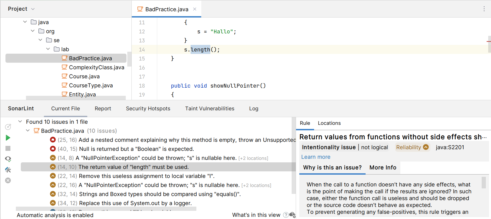
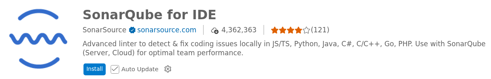

# SonarQube for IDE 

SonarQube for IDE (a.k.a. SonarLint) is a powerful static analysis tool that 
helps developers detect and fix quality issues as they write code. 
It integrates with Development Environments (IDEs) to provide 
**real-time feedback**, ensuring that code adheres 
to best practices and is free from bugs and vulnerabilities.

* **Real-Time Analysis**:
    Provides **immediate feedback** on code quality and potential issues as 
    we write code.
    Helps maintain high code quality and standards **from the beginning** of 
    the development process.

* **Integration with Popular IDEs**:
    Supports popular IDEs like IntelliJ IDEA, Eclipse, Visual Studio, 
    and **Visual Studio Code**.
    Seamlessly integrates into the development workflow without requiring 
    additional setup.

* **Detection of Code Smells**:
    Identifies common **programming errors** and **bad practices**, 
    known as **code smells**.
    Helps improve code readability and maintainability.

* **Security Vulnerabilities**:
    Detects security vulnerabilities and provides suggestions to mitigate them.
    Ensures that the code is secure and less prone to attacks.

* **Bug Detection**:
    Identifies **potential bugs** in the code that might lead to runtime errors.
    Helps developers fix bugs early in the development cycle.

* **Maintainability Issues**:
    Highlights areas of the code that might be difficult to maintain.
    Encourages writing clean, maintainable code.

SonarQube for IDE is an essential tool for developers aiming to write **clean, secure, 
and maintainable code**. By integrating seamlessly with popular IDEs and providing 
real-time feedback, it helps developers maintain high code quality and adhere to 
best practices throughout the development process.

## Setup 

In VS Code simply install the **SonarQube for IDE** extension:

## References

* [YouTube: SonarLint for VS Code Overview | A free and open source IDE extension](https://youtu.be/m8sAdYCIWhY?si=t13bwx-VCSgTDMVY)

*Egon Teiniker, 2016-2026, GPL v3.0*