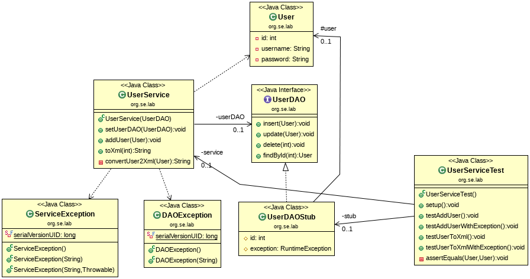

## Test Stub

This example shows how a **Test Stub** can be used to generate the indirect 
inputs for a SUT.



The class *UserService* should be tested (SUT). 
To satisfy the dependency to the type *UserDAO* for the tests, the class 
*UserDAOStub* (Test Stub) is used.

The test stub is instantiated by the test, configured and injected into the 
SUT injected (this is possible because there is an interface UserDAO):

```java
    @Before
    public void setup()
    {
        stub = new UserDAOStub();
        service = new UserService(stub);
    }    
```

Using the test stub, states can be verified after the test is run, 
e.g. data is in the test stub rather than in the database:

```java
    @Test
    public void testAddUser()
    {
        // exercise
    	User user = new User(7, "homer", "Kqq3lbODaQT4LvxsoihdknrtdSBiFOHaODQY65DJBS8=");
        service.addUser(user);      
        
        // verify
        assertEquals(user, stub.user);
    }        
```

The test stub can also be pre-configured 
to pass its data into the SUT as indirect input:

```java
    @Test
    public void testUserToXml()
    {
        // setup
    	stub.user = new User(7,"homer", "Kqq3lbODaQT4LvxsoihdknrtdSBiFOHaODQY65DJBS8=");

    	// exercise
        String xml = service.toXml(7);
        
        // verify
        String expected =
                "<user>" +
                    "<id>7</id>" +
                    "<name>homer</name>" +
                    "<password>Kqq3lbODaQT4LvxsoihdknrtdSBiFOHaODQY65DJBS8=</password>" +
                "</user>";
        Assert.assertEquals(expected, xml);
    }  
```

Finally, exceptions can also be configured that serve as indirect input. 
In this way, it is possible to test every error situation (and also every 
error handling in the SUT):

```java
    @Test
    public void testUserToXmlWithException()
    {
        // setup
        stub.exception = new DAOException("Can't find user!");

        // exercise
        try
        {
            service.toXml(7);
            Assert.fail();
        }
        catch(ServiceException e)
        {
            // verify
            Assert.assertEquals("Can't generate XML string!", e.getMessage());
            Assert.assertTrue(e.getCause() instanceof DAOException);
        }
    }
```

This example also shows the importance of software design for the 
testability of code. A SUT should only have dependencies on interface 
types, not on implementation classes.

*Egon Teiniker, 2016-2023, GPL v3.0*