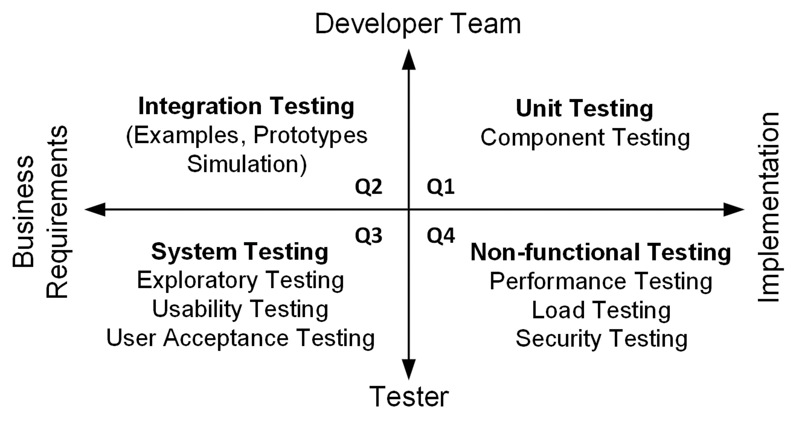

# Agile Testing

Following the principles of Lisa Crispin and Janet Gregory, we can divide the 
testing activities in a development iteration into four quadrants:

_Figure: Testing Quadrants (Crispin, 2008)_

## Q1: Unit Tests 
**Unit Tests** verify functionality of a small subset of the system (methods and objects).
**Component Tests** verify the behaviour of a larger part of the system (group of classes).

Unit and component tests are automated and written in the **same programming 
language** as the application.

Unit and component tests are **implemented by the team** (the tester supports the 
team by defining test cases).  

## Q2: Integration Tests 
**Functional Tests** which are customer tests define external quality and the 
features that the customer (PO) wants. These tests also drive development, 
but at a higher level.

These automated tests **run directly on the business logic** in the production 
code without having to go through a presentation layer.

Functional tests are **implemented by the team** based on examples and 
prototypes and test cases provided from the PO and the tester.

## Q3: GUI Tests
These business-facing tests exercise the working software to see if it 
doesn’t quit meet expectations. We try to emulate the way a real user would 
work the application.

This is mainly manual testing that only a human can do (use automated scripts 
to setup the data we need). 

GUI tests are **performed by the tester**.

## Q4:  Non-Functional Tests
These tests are intended to critique product characteristics such as 
performance, robustness, and security. 

Creating and running these tests might require the use of specialized tools 
and additional expertise. 

This job is **done by the tester** (usually the tester needs help from the team 
in technological issues).

## References

* Lisa Crispin, Janet Gregory. **Agile Testing**. Addison Wesley, 2009
* [Agile Testing](https://agiletester.ca/)
* [Agile Testing with Lisa Crispin](https://lisacrispin.com/)

*Egon Teiniker, 2016-2024, GPL v3.0*
