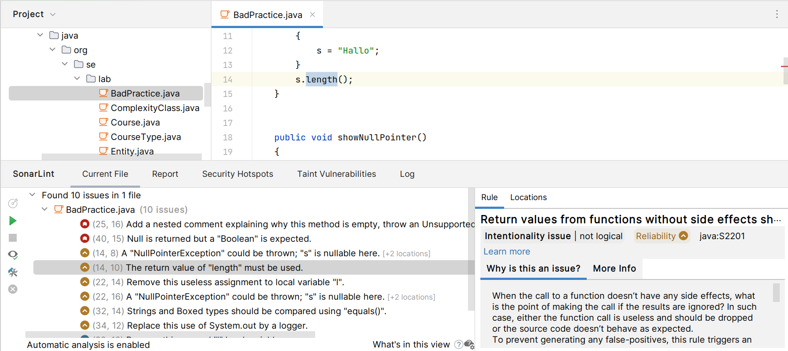
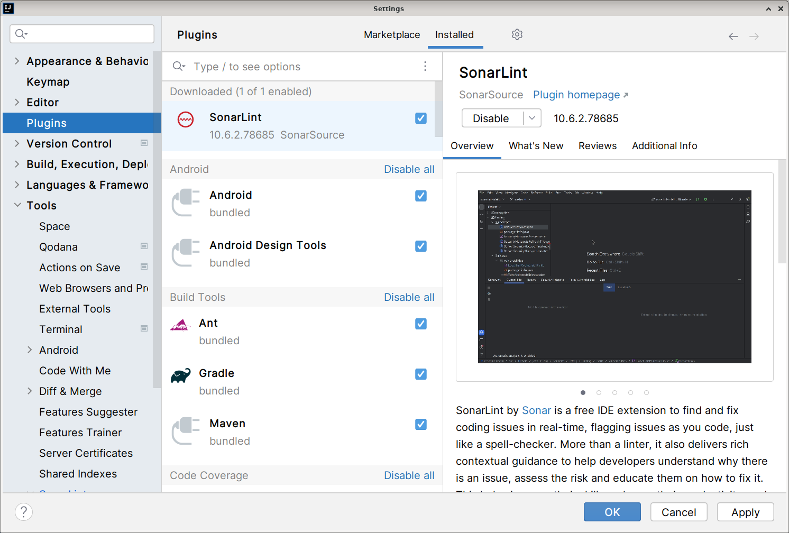

# SonarLint 

SonarLint is a powerful static analysis tool that helps developers detect and fix 
quality issues as they write code. It integrates with Integrated Development 
Environments (IDEs) to provide **real-time feedback**, ensuring that code adheres 
to best practices and is free from bugs and vulnerabilities.

* **Real-Time Analysis**:
    Provides **immediate feedback** on code quality and potential issues as 
    we write code.
    Helps maintain high code quality and standards **from the beginning** of 
    the development process.

* **Integration with Popular IDEs**:
    Supports popular IDEs like **IntelliJ IDEA**, Eclipse, Visual Studio, 
    and Visual Studio Code.
    Seamlessly integrates into the development workflow without requiring 
    additional setup.

* **Detection of Code Smells**:
    Identifies common **programming errors** and **bad practices**, 
    known as **code smells**.
    Helps improve code readability and maintainability.

* **Security Vulnerabilities**:
    Detects security vulnerabilities and provides suggestions to mitigate them.
    Ensures that the code is secure and less prone to attacks.

* **Bug Detection**:
    Identifies **potential bugs** in the code that might lead to runtime errors.
    Helps developers fix bugs early in the development cycle.

* **Maintainability Issues**:
    Highlights areas of the code that might be difficult to maintain.
    Encourages writing clean, maintainable code.

SonarLint is an essential tool for developers aiming to write **clean, secure, 
and maintainable code**. By integrating seamlessly with popular IDEs and providing 
real-time feedback, it helps developers maintain high code quality and adhere to 
best practices throughout the development process.

## Setup 

Go to **File | Settings... | Plugins** and select the tab Marketplace.
Search for **SonarLint** and hit the **Install** button.

In **File | Settings... | Tools | > SonarLint**, we can change some settings 
including the used **rules set**.

## References

* [SonarLint for IntelliJ and other JetBrains IDEs Overview](https://youtu.be/6Bv1wmj0jZI?si=Wy-4EhOPxm4Up6gP)

*Egon Teiniker, 2016-2024, GPL v3.0*