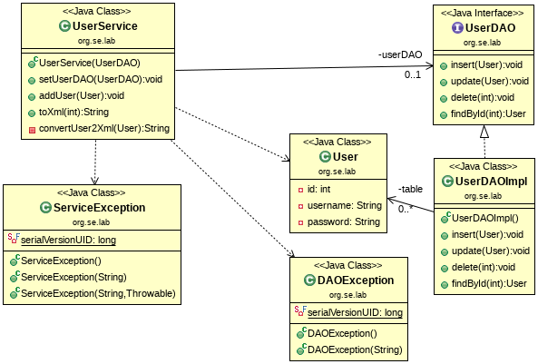

## Example: JUnit4-TestDouble-MockObject

This example shows how a mocking framework can be used to implement a test 
stub or a test spy.
It can be seen from the class diagram that no extra helper classes (stub or spy) 
need to be implemented for testing.



### Mockito
Mockito is an open source mocking framework for Java which allows the 
creation and management of external dependencies and allow mock object 
creation, verification, stubbing, and spying on real objects.

The following code snipped shows a simple test class using Mockito:
```java
public class UserServiceStubTest
{
    @Mock
    private UserDAO dao;

    @Before
    public void setup()
    {
        MockitoAnnotations.initMocks(this);
        //...   
    }
    
    //...        
```
A mock object can be defined using the *@Mock* annotation. 
To use this kind of dependency injection we have to call 
*MockitoAnnotations.initMocks(this)* in the setup method.


### Mockito as Test Stub 
The following examples show the use of mockito as a test stub. 
Note that no test stub needs to be implemented.

The stubbing process defines the behavior of a mock method, such as what 
value should be returned or whether any exception should be thrown when 
the method is invoked.

#### Stubbing Method Calls
The Mockito framework allows us to return a given value when a specific method is called.
It can be done using **Mockito.when()** along with **thenReturn()**.

```java
    @Test
    public void testUserToXml()
    {
        // setup
        User u = new User(7,"homer", "Kqq3lbODaQT4LvxsoihdknrtdSBiFOHaODQY65DJBS8=");
        when(dao.findById(7)).thenReturn(u);

        // exercise
        String xml = service.toXml(7);
        
        // verify
        String expected =
                "<user>" +
                    "<id>7</id>" +
                    "<name>homer</name>" +
                    "<password>Kqq3lbODaQT4LvxsoihdknrtdSBiFOHaODQY65DJBS8=</password>" +
                "</user>";
        Assert.assertEquals(expected, xml);
    }    
    
```

In the given test method we can find the line:

```java
when(dao.findById(7)).thenReturn(u);    
```
This means: If the method *findById()* will be invoked on the *dao* object 
(from the SUT) with the value *7*, the *User* object *u* will be returned. 
This behavior can be achieved without actually having to implement a test stub. 
The implementation is declarative.

Unit testing **void methods** is difficult because when a method doesn't 
return a value but only changes the internal state of the SUT, it becomes 
difficult to decide what to assert. 
In the Mockito framework, we can use the **verify()** method to check if a 
method has been invoked.

```java
    @Test
    public void testAddUser()
    {
        // exercise
        service.addUser(new User(7, "homer", "Kqq3lbODaQT4LvxsoihdknrtdSBiFOHaODQY65DJBS8="));

        // verify
        verify(dao).insert(isA(User.class));
    }    
```

Here, we can see the following verification:
```java
verify(dao).insert(isA(User.class));
```
Which means: Verify if the method *insert()* has been invoked on the *dao* 
object with a parameter of type *User*.

Mockito verifies argument values by using an object's equals() method.
**Argument matchers** bring in more flexibility. 
Mockito provides build-in matchers, such as *anyInt()*, *anyDouble()*, 
*anyString()*, *anyList()*, and *anyCollection()*.
The *isA()* matcher checks whether the passed object is an instance of 
the expected class type. The *any(T)* matcher also works in the same way.

An **ArgumentCaptor** object can verify the arguments passed to a stubbed method.
Sometimes, we pass an object to a method on a mocked dependency, but never return it.
Argument captors let us directly access these values provided to our mocks in 
order to examine them more closely.

```java
    @Test
    public void testAddUserWithArgumentCaptor()
    {
        ArgumentCaptor<User> captor = ArgumentCaptor.forClass(User.class);

        // exercise
        service.addUser(new User(7, "homer", "Kqq3lbODaQT4LvxsoihdknrtdSBiFOHaODQY65DJBS8="));

        // verify
        verify(dao).insert(captor.capture());
        Assert.assertEquals(7, captor.getValue().getId());
        Assert.assertEquals("homer", captor.getValue().getUsername());
        Assert.assertEquals("Kqq3lbODaQT4LvxsoihdknrtdSBiFOHaODQY65DJBS8=", captor.getValue().getPassword());
    }
```

An ArgumentCaptor object is defined as follows:
```java
ArgumentCaptor<T> captor = ArgumentCaptor.forClass(T.class);
```

To capture arguments, the following syntax is used:
```java
verify(mockObject).method(captor.capture());
```

Using the *captor.getValue()* method, the captured object can be analyzed.
If an ArgumentCaptor object captures arguments for multiple invocations, the captured values can be 
retrieved by calling the *captor.getAllValues()* method. 


#### Throwing Exceptions
To test the behavior in the event of an error, the method **thenThrow()** can 
be used.
```java
    @Test
    public void testUserToXmlWithException()
    {
        // setup
        when(dao.findById(7)).thenThrow(new DAOException("Can't find user!"));

        // exercise
        try
        {
            service.toXml(7);
            Assert.fail();
        }
        catch(ServiceException e)
        {
            // verify
            Assert.assertEquals("Can't generate XML string!", e.getMessage());
            Assert.assertTrue(e.getCause() instanceof DAOException);
        }
    }       
```

In the given test method we can find the line:

```java
when(dao.findById(7)).thenThrow(new DAOException("Can't find user!"));    
```
Which means: If the SUT invokes the method *findById(7)* on the *dao* object, 
a *DAOException* will be thrown.


To throw an exception from a **void method** (which is a method with no return 
value) we need a different syntax:

```java
doThrow(DAOException.class).when(dao).insert(isA(User.class));
```
Which means: If the *insert()* method of the *dao* object is invoked, throw
a DAOException. 
Note that an exception can either be specified by an exception object or 
an exception type. 


### Mockito as Test Spy

A Mockito Spy allows us to use real objects instead of mocks by replacing 
some of the methods with stubbed ones.
We can also use a Spy without doing any stubbing and just use them to verify 
interactions between two real objects.

To create a Spy instance we use the @Spy annotation.
Note that here both the real object UserDAOImpl is instantiated and a Spy 
proxy is generated.

```java
public class UserServiceSpyTest
{
    @Spy
    private UserDAOImpl dao;

    @Before
    public void setup()
    {
        MockitoAnnotations.initMocks(this);
        service = new UserService(dao);
        //...
    }
    //...
}    
```
Don't forget to to call *MockitoAnnotations.initMocks(this)* to trigger the 
dependency injections.

```java
    @Test
    public void testUserToXml()
    {
        // exercise
        String xml = service.toXml(7);

        // verify
        String expected =
                "<user>" +
                    "<id>7</id>" +
                    "<name>homer</name>" +
                    "<password>Kqq3lbODaQT4LvxsoihdknrtdSBiFOHaODQY65DJBS8=</password>" +
                "</user>";
        Assert.assertEquals(expected, xml);

        verify(dao, times(2)).insert(any(User.class));
        verify(dao).findById(7);
    }
```

Following the Spy approach, the interaction between the SUT and the real 
DOC is recorded and can then be evaluated.
```java
    verify(dao, times(2)).insert(any(User.class));
    verify(dao).findById(7);    
```
The first *verify()* statement checks if the *insert()* method was called 
exactly twice.
The second *verify()* statement checks if the *findById()* method was 
subsequently called with parameter *7*.


## References

* Sujoy Acharya. **Mockito Essentials**. Packt Publishing, 2014 
* [Mockito Web Page](https://site.mockito.org/)

*Egon Teiniker, 2018, GPL v3.0*