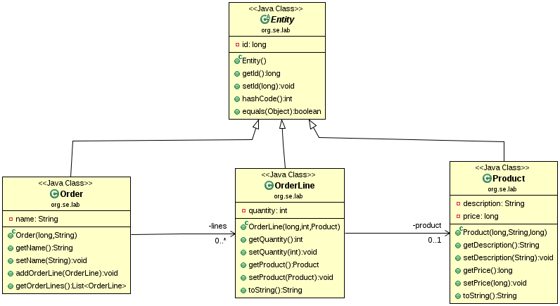

## JUnit4 Fixture Setup

This example shows different variants that can be used to create the 
following object structure as a test fixture.



### In-line fixture setup 

The setup code is embedded directly into the test method, which often 
leads to redundant code.

```java
public class SmellyFixtureTest
{
    @Test
    public void testOrder()
    { 
        // setup
        Order order = new Order(1, "Special order");   
        order.addOrderLine(new OrderLine(2, 1, new Product(3, "Pizza Frutti di Mare", 880)));
        order.addOrderLine(new OrderLine(4, 2, new Product(5, "Pizza Quattro Formaggi", 820)));
        ...
    }
}
```

### Delegated fixture setup 

A creation method is used to encapsulate the instantiation logic.

```java
public class DelegatedFixtureTest
{ 
    private Order createNewOrder()
    { 
        Order order = new Order(1, "Special order");
        order.addOrderLine(new OrderLine(2, 1, new Product(3, "Pizza Frutti di Mare", 880)));
        order.addOrderLine(new OrderLine(4, 2, new Product(5, "Pizza Quattro Formaggi", 820)));
        return order; 
    }

    @Test   
    public void testOrder()
    {
        // setup
        Order order = createNewOrder();
        ...
    }
}

```

### Implicit fixture setup

The instantiation code is moved to the **@Before** annotated method, which is executed before each test method.

```java
public class ImplicitFixtureTest
{   
    private Order order;
    
    @Before
    public void setup()
    {
        order = new Order(1, "Special order");
        order.addOrderLine(new OrderLine(2, 1, new Product(3, "Pizza Frutti di Mare", 880)));
        order.addOrderLine(new OrderLine(4, 2, new Product(5, "Pizza Quattro Formaggi", 820))); 
    }
    
    @Test
    public void testOrder()
    {
    	// exercise
    	long id = order.getId();    
    	String name = order.getName();
    	int numberOfLines = order.getOrderLines().size();
    	...
    }
```

*Egon Teiniker, 2018, GPL v3.0*
