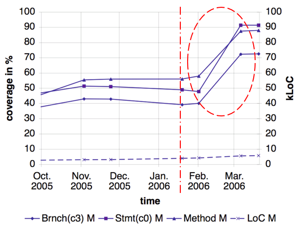

# Test-Case Design (Unit Tests)

In **white-box tests** we use the structure of the implementation 
to determine the number and type of test cases.

## Code Coverage Analysis

Code coverage is a metric used to measure the effectiveness of unit 
tests in covering the codebase. It provides insight into how much 
of the code is being tested by the unit tests. 

High code coverage, coupled with well-designed tests, contributes
significantly to the robustness and reliability of the software.

### Code Coverage Metrics 

Different coverage metrics are used in practice:

* **Function coverage** is a measure for verifying that each function
    (method) is invoked during test execution.

* **Block coverage** considers each sequence of non-branching 
    statements as its unit of code instead of individual statements.

* **Line coverage (statement coverage )** is a measure which indicates 
    the degree to which individual statements are getting executed 
    during test execution.

* **Branch coverage (decision coverage)** is a measure based on 
    whether decision points, such as if and while statements, evaluate 
    to both `true` and `false` during test execution, thus causing 
    both execution paths to be exercised. 

* **Condition coverage** extends the boolean evaluation of decision
    coverage into the sub-expressions (separated by logical ANDs and 
    ORs) as well, making sure, each of them is evaluated to both `true` 
    and `false`.

* **Path coverage** measures whether each possible path from start 
    (method entry) to finish (return statement, thrown exception) 
    is covered.

### Benefits of Code Coverage 

* **Detection of new defects**: Typically, many defects detected 
    using coverage visualization are related to error handling and 
    to special cases in the blue-sky behavior. 

* **Improvements of code robustness**: Coverage analysis demonstrates 
    the lack of tests of the handling of special cases and errors.  

* **Consolidation of the automated test cases**: As automated test 
    suites grow, it is often inevitable that the same aspect is tested 
    by several distinct test cases. Many coverage tools also show how
    often each line is executed.

### Lessons Learned from Practice

* Keep the feedback cycle between coding, testing and coverage
    visualization as short as possible.

* Don’t expect to find many new bugs in the blue-sky behavior of 
    your system.

* The primary goal is not to reach an ultimately high coverage rate, 
    but to exploit coverage visualization for identifying areas of 
    the code that are not covered by tests yet, but that are test-worthy.

* It is not necessary to operate coverage analysis over the complete
    development cycle.

* Don’t introduce coverage analysis and visualization tools in projects
    without a reasonably usable automated test suite.

* Resist the temptation to officially compete in the team or against 
    other teams for high coverage rates.

_Example:_ Impact of code coverage analysis on junior developers

Visualizing code coverage analysis is also a training tool to show
developers which parts of the code have not been tested yet.

## References

* Stefan Berner, Roland Weber, Rudolf K. Keller. **Enhancing Software Testing by Judicious Use of Code Coverage Information**. ICSE 2007

*Egon Teiniker, 2016-2024, GPL v3.0*
