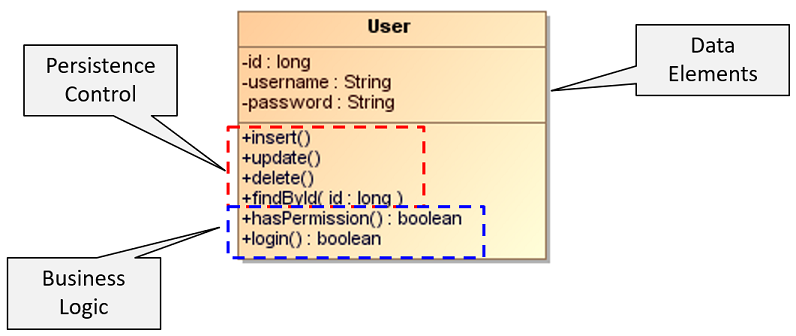
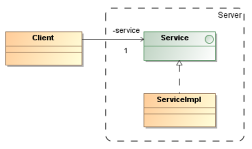
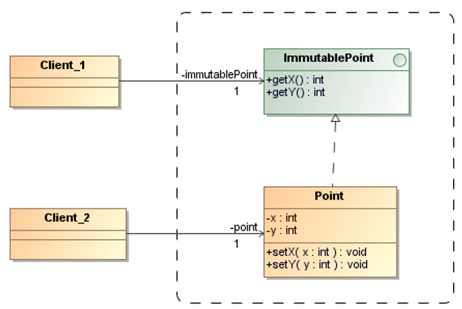
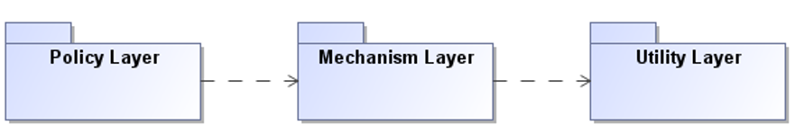
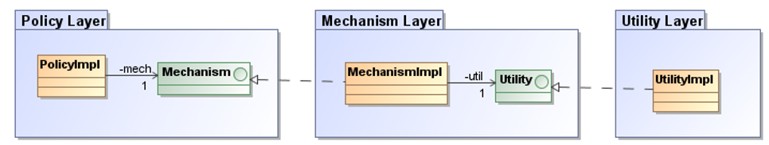

# Class Design Principles

## Introduction


The **UML diagrams** representing the source code are additive to the design 
but are not the design itself. We should not see UML diagrams separate from the code.

The **design of a software system** is an abstract concept.
It has to do with the overall shape and structure of the program as well 
as the detailed shape and structure of each module, class, and method.

> **In the end, the source code is the design!**


A principle of reusable object-oriented design that reduces implementation 
dependencies between subsystems significantly is:

> **Program to an interface, not an implementation!**

Don’t declare variables to be instances of particular concrete classes. 
Instead, commit only to an interface.


**Class inheritance** is defined statically at compile-time and is supported 
directly by the programming languages.

Disadvantages of class inheritance:
* We can’t change the implementations inherited from parent classes at run-time.
* The implementation of a subclass becomes so bound up with the implementation 
    of its parent class that any change in the parent’s implementation will force 
    the subclass to change. 
    Therefore, it’s often said that **inheritance breaks encapsulation**.

**Object composition** is defined dynamically at run-time through objects acquiring 
references to other objects.

Advantages of object composition:
* Because objects are accessed solely through their interfaces, we don’t break 
    encapsulation.
* Because object’s implementation will be written in terms of object interfaces, 
    there are substantially fewer implementation dependencies.

> **Favor object composition over class inheritance!**


## Single-Responsibility Principle (SRP)

> A class should have **only one reason to change**.

When the requirements change, that change will be manifest through a change in 
responsibility amongst the classes. 

If a class assumes more than one responsibility, then there will be more that one 
reason for it to change.

If a class has more than one responsibility, then the responsibilities become coupled. 

_Example:_ Violation of the SRP




## Open-Closed Principle (OCP)

> Software entities (methods, classes, modules, etc.) should be **open for extension** 
> but **closed for modification**.

* **Open for extension**: This means that the behavior of a module can be extended. 
    As the requirements of the application change, we are able to extend the module 
    with new behaviors that satisfy those changes.

* **Closed for modification**: Extending the behavior of a module does not result 
    in changes to the source or binary code of the module. The binary executable 
    version of the module remains untouched.

_Example_: A design that conforms to the OCP



The `Client` class is open for extension and closed for modification.


## Liskov Substitution Principle (LSP)

> **Subtypes must be substitutable** for their base types.

A class, viewed in isolation, cannot be meaningfully validated. The validity of 
a class can only be expressed in terms of its clients.

The LSP makes it clear that in OOD, the **is a** relationship applies to **behavior** 
that can be reasonably assumed and that clients depend on. 

The true definition of a subtype is **substitutable**, where substitutability 
is **defined by a contract**.

_Example:_ Design by Contract (DbC)\
    The contract is specified by declaring pre- and post-conditions for each operation 
    as well as invariants for a class.

* The **precondition (pre)** states the properties that must hold whenever the 
    operation is called.
* The **postcondition (post)** states the properties that the operation guarantees 
    when it returns.
* An **invariant (inv)** for a class C is a set of assertions that every instance 
    of C will satisfy at all “stable” times (on instance creation, before and after 
    every operation call). 
```
    {inv AND pre} op {inv AND post}
```

In the context of **inheritance**, subcontracting must be handled in a proper way: 
* For a **precondition**, all parents expressions are combined in a logical **OR** 
    relationship. A subclass operation’s precondition can only weaken the original.
* For a **postcondition**, all parent expressions are combined in a logical **AND** 
    relationship. A subclass operation’s postcondition can only be strengthen the original.
* **Invariants** accumulate down an inheritance structure. The invariants of all 
    parents apply to the subclass itself in a logical **AND** combination.


## Interface-Segregation Principle (ISP)

> Clients should not be forced to depend on methods that they do not use.

When clients are forced to depend on methods that they don’t use, then those 
clients are subject to changes to those methods. 
This results in an unintentional coupling between all the clients.

The interface of such a fat class can be broken up into groups of methods. 
Each group serves a different set of clients. 

_Example:_ Immutable Interface



The immutable interface hides methods of a class that could allow it to be modified 
in situations where you know it shouldn't be modified.


## Dependency-Inversion Principle (DIP)

> **High-level modules should not depend on low-level modules**. 
> Both should depend on abstractions.

> **Abstractions should not depend on (implementation) details**. 
> Details should depend on abstractions.

The dependency structure is **inverted** with respect to the dependency structure 
that normally results from traditional procedural methods (service interfaces are 
often owned by their clients).

Since the abstractions and details are all isolated from each other, the code is 
much easier to maintain.

_Example:_ Layering



A naive implementation of this architectural pattern might lead to a structure 
where the high-level **Policy Layer** uses a lower-level **Mechanism Layer**, 
which uses a detailed-level **Utility Layer**. 

_Example_: Dependency Inversion



In a more appropriate design, the upper-level layer declares abstract interfaces 
for the service that it needs. The lower-level layer is then realized from these 
abstract interfaces.

The lower-layers depend on abstract service interfaces declared in the upper layers.

This principle is sometimes known as the **Hollywood principle**: 
„Don‘t call us, we‘ll call you“


## References

* Robert C. Martin. **Agile Software Development – Principles, Patterns, and Practices**. Prentice Hall, 2003


*Egon Teiniker, 2016-2024, GPL v3.0*