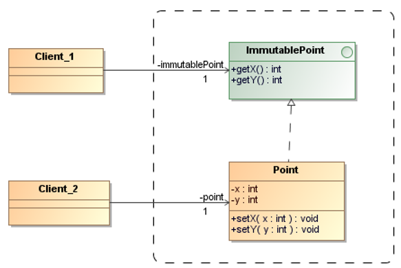

# Interface-Segregation Principle (ISP)

> Clients should not be forced to depend on methods that they do not use.

When clients are forced to depend on methods that they don’t use, then those 
clients are subject to changes to those methods. 
This results in an unintentional coupling between all the clients.

The interface of such a fat class can be broken up into groups of methods. 
Each group serves a different set of clients. 

_Example:_ Immutable Interface

The immutable interface hides methods of a class that could allow it to be modified 
in situations where you know it shouldn't be modified.

_Examples:_ GoF Patterns 

* **Adapter Pattern**: When a 3rd-party library provides a massive interface, 
    but our system only needs two methods, we use an Adapter. 
    It "segregates" the fat interface of the library into a lean, specific 
    interface that your client actually wants.

* **Facade Pattern**: A Facade provides a simplified, specific interface to 
    a complex subsystem. It prevents clients from having to "know" about dozens 
    of irrelevant methods in the underlying classes.

## References

* E. Gamma, R. Helm, R. Johnson, J. Vlissides. **Design Patterns, Elements of Reusable Object-Oriented Software**. Addison-Wesley, 1995

* Robert C. Martin. **Agile Software Development – Principles, Patterns, and Practices**. Prentice Hall, 2003

*Egon Teiniker, 2016-2026, GPL v3.0*