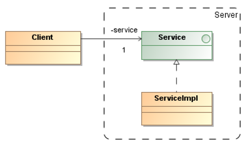

# Open-Closed Principle (OCP)

> Software entities (methods, classes, modules, etc.) should be **open for extension** 
> but **closed for modification**.

* **Open for extension**: This means that the behavior of a module can be extended. 
    As the requirements of the application change, we are able to extend the module 
    with new behaviors that satisfy those changes.

* **Closed for modification**: Extending the behavior of a module does not result 
    in changes to the source or binary code of the module. The binary executable 
    version of the module remains untouched.

_Example_: A design that conforms to the OCP

The `Client` class is open for extension and closed for modification.

_Examples:_ GoF Patterns 

* **Strategy Pattern**: If we need to add a new sorting algorithm, we don't 
    change the existing client class. We create a new implementation of 
    the `Sorting` interface. The system is extended without touching 
    tested code.

* **Decorator Pattern**: We can add new behaviors to an object at runtime 
    without modifying the original implementation class.

## References

* E. Gamma, R. Helm, R. Johnson, J. Vlissides. **Design Patterns, Elements of Reusable Object-Oriented Software**. Addison-Wesley, 1995

* Robert C. Martin. **Agile Software Development – Principles, Patterns, and Practices**. Prentice Hall, 2003

*Egon Teiniker, 2016-2026, GPL v3.0*
