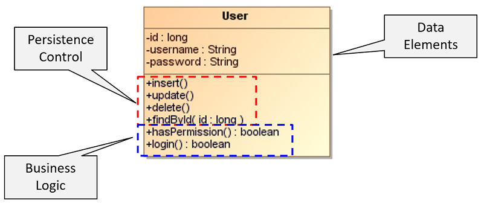

# Single-Responsibility Principle (SRP)

> A class should have **only one reason to change**.

When the requirements change, that change will be manifest through a change in 
responsibility amongst the classes. 

If a class assumes more than one responsibility, then there will be more that one 
reason for it to change.

If a class has more than one responsibility, then the responsibilities become coupled. 

_Example:_ Violation of the SRP

_Examples:_ GoF Patterns 

* **Command Pattern**: 
    The Command pattern encapsulates each operation into its own object. 
    

## References

* E. Gamma, R. Helm, R. Johnson, J. Vlissides. **Design Patterns, Elements of Reusable Object-Oriented Software**. Addison-Wesley, 1995

* Robert C. Martin. **Agile Software Development – Principles, Patterns, and Practices**. Prentice Hall, 2003

*Egon Teiniker, 2016-2026, GPL v3.0*    

